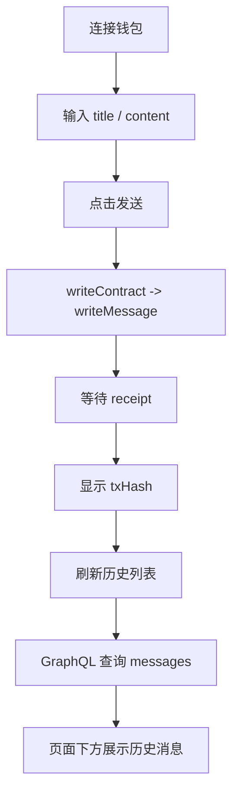

# ETH Event Logs 前端开发执行文档

## 目标

补完 [apps/web/src/app/eth-event-logs/page.tsx](/Volumes/HS-SSD-1TB/works/my-dapp-home-work-30/apps/web/src/app/eth-event-logs/page.tsx)，让页面具备两块能力：

1. 数据上链发送  
连接钱包后，调用 `MessageBoard.writeMessage(title, content)` 把消息写上链。

2. 历史信息列表  
页面下方读取 The Graph 的 `messages`，显示历史记录。

## 本次实现边界

这次是全新实现一套，不修改 [apps/web/src/app/eth-page/useOnChainNote.ts](/Volumes/HS-SSD-1TB/works/my-dapp-home-work-30/apps/web/src/app/eth-page/useOnChainNote.ts)。

那份文件只作为“wagmi 状态机写法”的参考，不参与这次开发。

这次要新建的文件是：

```text
apps/web/src/app/eth-event-logs/
├── page.tsx
├── constants.ts
├── message-board-abi.ts
├── useMessageBoardWrite.ts
├── useMessageHistory.ts
├── EventLogComposer.tsx
└── EventLogHistoryList.tsx
```

## 页面链路



## Step 0：先准备环境变量

在 `apps/web/.env.local` 或项目根 `.env` 里补一个前端可读地址：

```bash
NEXT_PUBLIC_MESSAGE_BOARD_GRAPH_ENDPOINT=https://api.studio.thegraph.com/query/xxx/message-board-sepolia-demo/latest
```

说明：

- 这里直接用 `NEXT_PUBLIC_`，这样客户端组件里可以直接读取
- 这次不接入 `packages/env`，先跑通页面

## Step 1：先写常量文件

创建 [apps/web/src/app/eth-event-logs/constants.ts](/Volumes/HS-SSD-1TB/works/my-dapp-home-work-30/apps/web/src/app/eth-event-logs/constants.ts)：

```ts
export const MESSAGE_BOARD_ADDRESS =
  "0x20CD59B47e1D1a6e8f86Ce57dDEDfdEd9c7566F8" as const;

export const MESSAGE_BOARD_CHAIN_ID = 11155111;

export const MESSAGE_HISTORY_PAGE_SIZE = 20;

export const MESSAGE_TITLE_MAX_LENGTH = 80;

export const MESSAGE_CONTENT_MAX_LENGTH = 500;

export const MESSAGE_BOARD_GRAPH_ENDPOINT =
  process.env.NEXT_PUBLIC_MESSAGE_BOARD_GRAPH_ENDPOINT ?? "";

export const SEPOLIA_TX_BASE_URL = "https://sepolia.etherscan.io/tx/";
```

这一步完成后，你就把“地址、链、分页、env”这些硬依赖固定住了。

## Step 2：写最小 ABI

创建 [apps/web/src/app/eth-event-logs/message-board-abi.ts](/Volumes/HS-SSD-1TB/works/my-dapp-home-work-30/apps/web/src/app/eth-event-logs/message-board-abi.ts)：

```ts
export const messageBoardAbi = [
  {
    type: "function",
    name: "writeMessage",
    stateMutability: "nonpayable",
    inputs: [
      { name: "title", type: "string" },
      { name: "content", type: "string" },
    ],
    outputs: [],
  },
] as const;
```

这里不需要整个 artifact，只保留前端调用要用到的 ABI 即可。

## Step 3：新写发送 hook

创建 [apps/web/src/app/eth-event-logs/useMessageBoardWrite.ts](/Volumes/HS-SSD-1TB/works/my-dapp-home-work-30/apps/web/src/app/eth-event-logs/useMessageBoardWrite.ts)：

```ts
"use client";

import { useEffect, useState } from "react";
import { useAccount, useWaitForTransactionReceipt, useWriteContract } from "wagmi";
import {
  MESSAGE_BOARD_ADDRESS,
  MESSAGE_BOARD_CHAIN_ID,
  MESSAGE_CONTENT_MAX_LENGTH,
  MESSAGE_TITLE_MAX_LENGTH,
} from "./constants";
import { messageBoardAbi } from "./message-board-abi";

export type MessageBoardWriteStatus =
  | "idle"
  | "signing"
  | "confirming"
  | "success"
  | "error";

type SubmitInput = {
  title: string;
  content: string;
};

export function useMessageBoardWrite() {
  const { address, chainId, isConnected } = useAccount();
  const { writeContractAsync } = useWriteContract();

  const [status, setStatus] = useState<MessageBoardWriteStatus>("idle");
  const [txHash, setTxHash] = useState<`0x${string}` | undefined>(undefined);
  const [errorMsg, setErrorMsg] = useState<string | undefined>(undefined);

  const isWrongChain =
    typeof chainId === "number" && chainId !== MESSAGE_BOARD_CHAIN_ID;

  const { data: receipt, error: receiptError } = useWaitForTransactionReceipt({
    hash: txHash,
    query: {
      enabled: !!txHash && status === "confirming",
    },
  });

  useEffect(() => {
    if (status !== "confirming") return;

    if (receiptError) {
      setErrorMsg(receiptError.message ?? "Transaction confirmation failed");
      setStatus("error");
      return;
    }

    if (!receipt) return;

    if (receipt.status === "reverted") {
      setErrorMsg("Transaction was reverted on-chain");
      setStatus("error");
      return;
    }

    setStatus("success");
  }, [receipt, receiptError, status]);

  useEffect(() => {
    reset();
    // eslint-disable-next-line react-hooks/exhaustive-deps
  }, [address, chainId]);

  function reset() {
    setStatus("idle");
    setTxHash(undefined);
    setErrorMsg(undefined);
  }

  async function submit(input: SubmitInput) {
    const title = input.title.trim();
    const content = input.content.trim();

    if (!isConnected || !address) {
      setErrorMsg("Please connect your wallet first");
      setStatus("error");
      return;
    }

    if (isWrongChain) {
      setErrorMsg("Please switch wallet network to Sepolia");
      setStatus("error");
      return;
    }

    if (!title) {
      setErrorMsg("Title cannot be empty");
      setStatus("error");
      return;
    }

    if (!content) {
      setErrorMsg("Content cannot be empty");
      setStatus("error");
      return;
    }

    if (title.length > MESSAGE_TITLE_MAX_LENGTH) {
      setErrorMsg(`Title too long, max ${MESSAGE_TITLE_MAX_LENGTH} chars`);
      setStatus("error");
      return;
    }

    if (content.length > MESSAGE_CONTENT_MAX_LENGTH) {
      setErrorMsg(`Content too long, max ${MESSAGE_CONTENT_MAX_LENGTH} chars`);
      setStatus("error");
      return;
    }

    try {
      setErrorMsg(undefined);
      setStatus("signing");

      const hash = await writeContractAsync({
        address: MESSAGE_BOARD_ADDRESS,
        abi: messageBoardAbi,
        functionName: "writeMessage",
        args: [title, content],
        chainId: MESSAGE_BOARD_CHAIN_ID,
      });

      setTxHash(hash);
      setStatus("confirming");
    } catch (error) {
      const message =
        error instanceof Error ? error.message : "Failed to submit transaction";

      setErrorMsg(
        message.includes("User rejected") || message.includes("User denied")
          ? "Transaction rejected by user"
          : message,
      );
      setStatus("error");
    }
  }

  return {
    address,
    chainId,
    isConnected,
    isWrongChain,
    status,
    txHash,
    errorMsg,
    submit,
    reset,
  };
}
```

### 这一步怎么自测

你先不用做 UI，只要保证这个 hook 的职责是完整的：

1. 能识别钱包是否连接
2. 能识别是否是 Sepolia
3. 能调用 `writeMessage`
4. 能拿到 `txHash`
5. 能从 `confirming` 进入 `success`

## Step 4：新写历史列表 hook

创建 [apps/web/src/app/eth-event-logs/useMessageHistory.ts](/Volumes/HS-SSD-1TB/works/my-dapp-home-work-30/apps/web/src/app/eth-event-logs/useMessageHistory.ts)：

```ts
"use client";

import { useEffect, useState } from "react";
import {
  MESSAGE_BOARD_GRAPH_ENDPOINT,
  MESSAGE_HISTORY_PAGE_SIZE,
} from "./constants";

export type MessageHistoryItem = {
  id: string;
  author: string;
  title: string;
  content: string;
  createdAt: string;
  blockNumber: string;
  blockTimestamp: string;
  transactionHash: string;
};

type GraphResponse = {
  data?: {
    messages?: MessageHistoryItem[];
  };
  errors?: Array<{ message: string }>;
};

const QUERY = `
  query Messages($first: Int!) {
    messages(first: $first, orderBy: blockTimestamp, orderDirection: desc) {
      id
      author
      title
      content
      createdAt
      blockNumber
      blockTimestamp
      transactionHash
    }
  }
`;

type UseMessageHistoryParams = {
  refreshKey?: number;
  pageSize?: number;
  expectedTxHash?: string | null;
};

export function useMessageHistory(params?: UseMessageHistoryParams) {
  const refreshKey = params?.refreshKey ?? 0;
  const pageSize = params?.pageSize ?? MESSAGE_HISTORY_PAGE_SIZE;
  const expectedTxHash = params?.expectedTxHash ?? null;

  const [items, setItems] = useState<MessageHistoryItem[]>([]);
  const [isLoading, setIsLoading] = useState(true);
  const [isRefreshing, setIsRefreshing] = useState(false);
  const [isSyncing, setIsSyncing] = useState(false);
  const [error, setError] = useState<string | undefined>(undefined);
  const [retrySeed, setRetrySeed] = useState(0);

  useEffect(() => {
    let cancelled = false;
    let timer: number | undefined;

    async function requestMessages() {
      const response = await fetch(MESSAGE_BOARD_GRAPH_ENDPOINT, {
        method: "POST",
        headers: {
          "content-type": "application/json",
        },
        body: JSON.stringify({
          query: QUERY,
          variables: {
            first: pageSize,
          },
        }),
      });

      if (!response.ok) {
        throw new Error(`Graph request failed: ${response.status}`);
      }

      const json = (await response.json()) as GraphResponse;

      if (json.errors?.length) {
        throw new Error(json.errors[0]?.message ?? "Graph query failed");
      }

      return json.data?.messages ?? [];
    }

    async function run() {
      if (!MESSAGE_BOARD_GRAPH_ENDPOINT) {
        setError("NEXT_PUBLIC_MESSAGE_BOARD_GRAPH_ENDPOINT is missing");
        setIsLoading(false);
        setIsRefreshing(false);
        setIsSyncing(false);
        return;
      }

      setError(undefined);
      if (items.length === 0) {
        setIsLoading(true);
      } else {
        setIsRefreshing(true);
      }

      try {
        const firstBatch = await requestMessages();
        if (cancelled) return;

        setItems(firstBatch);
        setIsLoading(false);
        setIsRefreshing(false);

        if (!expectedTxHash) {
          setIsSyncing(false);
          return;
        }

        const foundImmediately = firstBatch.some(
          (item) =>
            item.transactionHash.toLowerCase() === expectedTxHash.toLowerCase(),
        );

        if (foundImmediately) {
          setIsSyncing(false);
          return;
        }

        setIsSyncing(true);

        let attempt = 0;

        async function poll() {
          attempt += 1;

          try {
            const nextBatch = await requestMessages();
            if (cancelled) return;

            setItems(nextBatch);

            const found = nextBatch.some(
              (item) =>
                item.transactionHash.toLowerCase() ===
                expectedTxHash.toLowerCase(),
            );

            if (found || attempt >= 5) {
              setIsSyncing(false);
              return;
            }

            timer = window.setTimeout(() => {
              void poll();
            }, 2000);
          } catch (pollError) {
            if (cancelled) return;
            setError(
              pollError instanceof Error ? pollError.message : "Graph poll failed",
            );
            setIsSyncing(false);
          }
        }

        timer = window.setTimeout(() => {
          void poll();
        }, 2000);
      } catch (requestError) {
        if (cancelled) return;
        setError(
          requestError instanceof Error
            ? requestError.message
            : "Failed to load message history",
        );
        setIsLoading(false);
        setIsRefreshing(false);
        setIsSyncing(false);
      }
    }

    void run();

    return () => {
      cancelled = true;
      if (timer) {
        window.clearTimeout(timer);
      }
    };
  }, [expectedTxHash, pageSize, refreshKey, retrySeed]);

  function refetch() {
    setRetrySeed((value) => value + 1);
  }

  return {
    items,
    isLoading,
    isRefreshing,
    isSyncing,
    error,
    refetch,
  };
}
```

### 这一步怎么自测

先不接页面，先只确认这几个行为：

1. endpoint 没配时，会提示错误
2. endpoint 正确时，能拿到 `messages`
3. `refreshKey` 变化后会重拉
4. 新交易刚成功但还没被索引时，会进入 `isSyncing`

## Step 5：写发送组件

创建 [apps/web/src/app/eth-event-logs/EventLogComposer.tsx](/Volumes/HS-SSD-1TB/works/my-dapp-home-work-30/apps/web/src/app/eth-event-logs/EventLogComposer.tsx)：

```tsx
"use client";

import { useEffect, useRef, useState } from "react";
import { Input } from "@my-dapp-home-work-30/ui/components/input";
import { Textarea } from "@my-dapp-home-work-30/ui/components/textarea";
import { Label } from "@my-dapp-home-work-30/ui/components/label";
import { Button } from "@my-dapp-home-work-30/ui/components/button";
import {
  Card,
  CardAction,
  CardContent,
  CardDescription,
  CardHeader,
  CardTitle,
} from "@my-dapp-home-work-30/ui/components/card";
import {
  MESSAGE_BOARD_CHAIN_ID,
  MESSAGE_CONTENT_MAX_LENGTH,
  MESSAGE_TITLE_MAX_LENGTH,
  SEPOLIA_TX_BASE_URL,
} from "./constants";
import { useMessageBoardWrite } from "./useMessageBoardWrite";

type EventLogComposerProps = {
  onSubmitted?: (txHash: string) => void;
};

export default function EventLogComposer({
  onSubmitted,
}: EventLogComposerProps) {
  const [title, setTitle] = useState("");
  const [content, setContent] = useState("");
  const notifiedTxHashRef = useRef<string | undefined>(undefined);

  const {
    address,
    chainId,
    isConnected,
    isWrongChain,
    status,
    txHash,
    errorMsg,
    submit,
    reset,
  } = useMessageBoardWrite();

  const isProcessing = status === "signing" || status === "confirming";

  useEffect(() => {
    if (!txHash) return;
    if (status !== "success") return;
    if (notifiedTxHashRef.current === txHash) return;

    notifiedTxHashRef.current = txHash;
    onSubmitted?.(txHash);
    setTitle("");
    setContent("");
  }, [onSubmitted, status, txHash]);

  function handleSubmit(event: React.FormEvent<HTMLFormElement>) {
    event.preventDefault();
    void submit({ title, content });
  }

  function handleReset() {
    setTitle("");
    setContent("");
    reset();
  }

  return (
    <Card className="border-border/80">
      <CardHeader className="border-b">
        <div>
          <CardTitle>Event Message Composer</CardTitle>
          <CardDescription>
            调用 MessageBoard.writeMessage(title, content) 发链上日志
          </CardDescription>
        </div>

        <CardAction>
          <span className="rounded-none border border-blue-500/30 bg-blue-500/10 px-2 py-1 text-[10px] text-blue-300">
            Target Chain {MESSAGE_BOARD_CHAIN_ID}
          </span>
        </CardAction>
      </CardHeader>

      <CardContent className="pt-4">
        <form className="flex flex-col gap-4" onSubmit={handleSubmit}>
          <div className="grid gap-1.5">
            <Label>Current Account</Label>
            <div className="rounded-none border border-input bg-input/20 px-3 py-2 font-mono text-xs">
              {isConnected && address ? address : "Wallet not connected"}
            </div>
          </div>

          <div className="grid gap-1.5">
            <Label htmlFor="message-title">
              Title ({title.length}/{MESSAGE_TITLE_MAX_LENGTH})
            </Label>
            <Input
              id="message-title"
              value={title}
              maxLength={MESSAGE_TITLE_MAX_LENGTH}
              disabled={isProcessing}
              placeholder="Input message title"
              onChange={(event) => {
                setTitle(event.target.value);
                if (status === "error") reset();
              }}
            />
          </div>

          <div className="grid gap-1.5">
            <Label htmlFor="message-content">
              Content ({content.length}/{MESSAGE_CONTENT_MAX_LENGTH})
            </Label>
            <Textarea
              id="message-content"
              rows={6}
              value={content}
              maxLength={MESSAGE_CONTENT_MAX_LENGTH}
              disabled={isProcessing}
              placeholder="Input message content"
              onChange={(event) => {
                setContent(event.target.value);
                if (status === "error") reset();
              }}
            />
          </div>

          <div className="rounded-none border border-input bg-input/10 px-3 py-2 text-xs text-muted-foreground">
            <div>Wallet chain: {chainId ?? "unknown"}</div>
            <div>Status: {status}</div>
            {isWrongChain ? (
              <div className="mt-1 text-destructive">
                Please switch MetaMask network to Sepolia
              </div>
            ) : null}
          </div>

          {errorMsg ? (
            <div className="rounded-none border border-destructive/30 bg-destructive/10 px-3 py-2 text-xs text-destructive">
              {errorMsg}
            </div>
          ) : null}

          {txHash ? (
            <div className="rounded-none border border-green-500/20 bg-green-500/5 px-3 py-2 text-xs">
              <div className="mb-1 text-green-400">Transaction Hash</div>
              <a
                className="break-all font-mono text-blue-300 underline"
                href={`${SEPOLIA_TX_BASE_URL}${txHash}`}
                target="_blank"
                rel="noreferrer"
              >
                {txHash}
              </a>
            </div>
          ) : null}

          <div className="flex gap-2">
            <Button
              type="submit"
              size="lg"
              disabled={
                !isConnected ||
                isWrongChain ||
                isProcessing ||
                title.trim().length === 0 ||
                content.trim().length === 0
              }
              className="flex-1"
            >
              {status === "signing"
                ? "Waiting for wallet signature..."
                : status === "confirming"
                  ? "Waiting for confirmation..."
                  : "发送上链"}
            </Button>

            <Button
              type="button"
              variant="outline"
              size="lg"
              disabled={isProcessing}
              onClick={handleReset}
            >
              Reset
            </Button>
          </div>
        </form>
      </CardContent>
    </Card>
  );
}
```

### 这一步怎么自测

先只看上半部分：

1. 钱包地址能显示
2. 标题和正文可以输入
3. 非 Sepolia 时会提示
4. 发起交易后按钮会进入 loading 文案
5. 成功后能看到 `txHash`

## Step 6：写历史列表组件

创建 [apps/web/src/app/eth-event-logs/EventLogHistoryList.tsx](/Volumes/HS-SSD-1TB/works/my-dapp-home-work-30/apps/web/src/app/eth-event-logs/EventLogHistoryList.tsx)：

```tsx
"use client";

import { Button } from "@my-dapp-home-work-30/ui/components/button";
import {
  Card,
  CardAction,
  CardContent,
  CardDescription,
  CardHeader,
  CardTitle,
} from "@my-dapp-home-work-30/ui/components/card";
import { Separator } from "@my-dapp-home-work-30/ui/components/separator";
import { Skeleton } from "@my-dapp-home-work-30/ui/components/skeleton";
import {
  MESSAGE_HISTORY_PAGE_SIZE,
  SEPOLIA_TX_BASE_URL,
} from "./constants";
import { useMessageHistory } from "./useMessageHistory";

type EventLogHistoryListProps = {
  refreshKey: number;
  expectedTxHash?: string | null;
};

function formatTimestamp(value: string) {
  const seconds = Number(value);
  if (!Number.isFinite(seconds)) return value;

  return new Date(seconds * 1000).toLocaleString();
}

function shortenHex(value: string, left = 8, right = 6) {
  if (value.length <= left + right) return value;
  return `${value.slice(0, left)}...${value.slice(-right)}`;
}

export default function EventLogHistoryList(
  props: EventLogHistoryListProps,
) {
  const { items, isLoading, isRefreshing, isSyncing, error, refetch } =
    useMessageHistory({
      refreshKey: props.refreshKey,
      pageSize: MESSAGE_HISTORY_PAGE_SIZE,
      expectedTxHash: props.expectedTxHash,
    });

  return (
    <Card className="border-border/80">
      <CardHeader className="border-b">
        <div>
          <CardTitle>Message History</CardTitle>
          <CardDescription>
            历史记录来自 The Graph 的 messages 查询结果
          </CardDescription>
        </div>

        <CardAction className="flex items-center gap-2">
          {isSyncing ? (
            <span className="rounded-none border border-amber-500/30 bg-amber-500/10 px-2 py-1 text-[10px] text-amber-300">
              The Graph syncing...
            </span>
          ) : null}
          {isRefreshing ? (
            <span className="rounded-none border border-blue-500/30 bg-blue-500/10 px-2 py-1 text-[10px] text-blue-300">
              Refreshing...
            </span>
          ) : null}
          <Button variant="outline" size="sm" onClick={refetch}>
            Refresh
          </Button>
        </CardAction>
      </CardHeader>

      <CardContent className="pt-4">
        {isLoading ? (
          <div className="flex flex-col gap-3">
            <Skeleton className="h-20 w-full" />
            <Skeleton className="h-20 w-full" />
            <Skeleton className="h-20 w-full" />
          </div>
        ) : null}

        {!isLoading && error ? (
          <div className="rounded-none border border-destructive/30 bg-destructive/10 px-3 py-3 text-xs text-destructive">
            <div className="mb-2">{error}</div>
            <Button variant="outline" size="sm" onClick={refetch}>
              Retry
            </Button>
          </div>
        ) : null}

        {!isLoading && !error && items.length === 0 ? (
          <div className="rounded-none border border-input bg-input/10 px-3 py-6 text-center text-xs text-muted-foreground">
            No messages yet. Submit the first message above.
          </div>
        ) : null}

        {!isLoading && !error && items.length > 0 ? (
          <div className="flex flex-col">
            {items.map((item, index) => (
              <div key={item.id} className="py-3">
                <div className="mb-2 flex items-center justify-between gap-3">
                  <div className="text-sm font-medium">{item.title}</div>
                  <div className="text-[10px] text-muted-foreground">
                    #{index + 1}
                  </div>
                </div>

                <div className="mb-3 whitespace-pre-wrap text-xs text-foreground/80">
                  {item.content}
                </div>

                <div className="grid gap-1 text-[11px] text-muted-foreground">
                  <div>Author: {shortenHex(item.author)}</div>
                  <div>Block Time: {formatTimestamp(item.blockTimestamp)}</div>
                  <div>Block Number: {item.blockNumber}</div>
                  <div>
                    Tx:
                    {" "}
                    <a
                      className="font-mono text-blue-300 underline"
                      href={`${SEPOLIA_TX_BASE_URL}${item.transactionHash}`}
                      target="_blank"
                      rel="noreferrer"
                    >
                      {shortenHex(item.transactionHash, 12, 8)}
                    </a>
                  </div>
                </div>

                {index < items.length - 1 ? <Separator className="mt-3" /> : null}
              </div>
            ))}
          </div>
        ) : null}
      </CardContent>
    </Card>
  );
}
```

### 这一步怎么自测

先只验证下半部分：

1. 首次进入有 loading
2. endpoint 配错时会报错
3. 无数据时会显示 empty
4. 有数据时能按列表显示
5. 手动点 Refresh 可以重拉

## Step 7：组合页面

最后改 [apps/web/src/app/eth-event-logs/page.tsx](/Volumes/HS-SSD-1TB/works/my-dapp-home-work-30/apps/web/src/app/eth-event-logs/page.tsx)：

```tsx
"use client";

import { useState } from "react";
import EventLogComposer from "./EventLogComposer";
import EventLogHistoryList from "./EventLogHistoryList";

export default function Page() {
  const [refreshKey, setRefreshKey] = useState(0);
  const [expectedTxHash, setExpectedTxHash] = useState<string | null>(null);

  function handleSubmitted(txHash: string) {
    setExpectedTxHash(txHash);
    setRefreshKey((value) => value + 1);
  }

  return (
    <main className="flex min-h-0 flex-1 justify-center overflow-y-auto p-6">
      <div className="flex w-full max-w-3xl flex-col gap-6">
        <EventLogComposer onSubmitted={handleSubmitted} />
        <EventLogHistoryList
          refreshKey={refreshKey}
          expectedTxHash={expectedTxHash}
        />
      </div>
    </main>
  );
}
```

到这里，页面的完整链路就串起来了。

## Step 8：启动联调

启动前端：

```bash
pnpm dev:web
```

或者单独启动 web：

```bash
cd apps/web
pnpm dev:bare
```

如果你刚补了 Subgraph，需要重新构建部署：

```bash
cd packages/subgraph
pnpm codegen
pnpm build
pnpm deploy
```

## 手工验收顺序

按这个顺序验收最稳：

1. 打开 `/eth-event-logs`
2. 连接钱包
3. 如果不是 Sepolia，确认页面有错误提示
4. 切到 Sepolia
5. 输入 `title` 和 `content`
6. 点击发送，确认 MetaMask 正常弹窗
7. 交易确认后页面显示 `txHash`
8. 下方列表进入刷新
9. 如果索引稍慢，页面显示 `The Graph syncing...`
10. 最终新消息出现在历史列表顶部

## 你现在应该怎么一步一步实现

建议你就按下面顺序抄代码和验证，不要同时开太多文件：

1. 先创建 `constants.ts`
2. 再创建 `message-board-abi.ts`
3. 再创建 `useMessageBoardWrite.ts`
4. 再创建 `useMessageHistory.ts`
5. 再创建 `EventLogComposer.tsx`
6. 再创建 `EventLogHistoryList.tsx`
7. 最后替换 `page.tsx`

每完成一步，就先保存并看 TypeScript 报错，再做下一步。

## 验收清单

- [ ] 没有修改 `eth-page/useOnChainNote.ts`
- [ ] `eth-event-logs` 目录下新建了独立 hook 和组件
- [ ] 可以调用 `writeMessage(title, content)`
- [ ] 成功后能显示 `txHash`
- [ ] 页面下方能读取 The Graph 历史消息
- [ ] 历史列表支持 loading / error / empty / success
- [ ] 发送成功后会自动刷新列表
- [ ] 能处理 The Graph 索引延迟

## 最终链路

```text
输入 title 和 content
-> 调用 MessageBoard.writeMessage
-> 等待链上确认
-> 拿到 txHash
-> 触发历史列表刷新
-> GraphQL 查询 messages
-> 页面下方显示新记录
```
