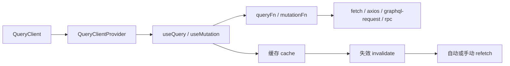

# TanStack React Query 核心对象与使用指南

## 适用范围

本项目 `apps/web` 当前使用的是：

```json
"@tanstack/react-query": "^5.90.12"
```

本文按 `v5` 来讲，重点覆盖：

1. 核心对象是什么
2. 每个对象解决什么问题
3. 常用写法怎么落地
4. 在你当前项目里有哪些对应例子
5. 实战时容易踩的坑和技巧

## 它到底是干什么的

TanStack Query 主要是管理“服务端状态”。

这里的“服务端状态”包括：

- HTTP API 返回的数据
- RPC 请求结果
- GraphQL 查询结果
- 钱包余额
- 区块链节点返回的数据

它最核心解决的是这几件事：

- 请求怎么发
- 数据怎么缓存
- 什么时候自动重拉
- 什么时候手动刷新
- 写操作之后怎么让旧数据失效

官方把它描述成一个专门处理 `fetching / caching / synchronizing / updating server state` 的库。  
参考：<https://tanstack.com/query/v5/docs/framework/react/overview>

## 先记一条总链路



你可以把它理解成：

- `fetch` 负责“发请求”
- `React Query` 负责“管理请求结果”

## 核心对象总览

### 1. `QueryClient`

这是 React Query 的“大脑”。

它负责：

- 管理缓存
- 管理 query / mutation 生命周期
- 做失效、重拉、预取、手动写缓存

最典型创建方式：

```ts
import { QueryClient } from "@tanstack/react-query";

const queryClient = new QueryClient();
```

官方文档里，`QueryClient` 提供了这些重要能力：

- `invalidateQueries`
- `refetchQueries`
- `setQueryData`
- `getQueryData`
- `prefetchQuery`
- `fetchQuery`

参考：<https://tanstack.com/query/v5/docs/reference/QueryClient>

你项目里的例子：

- [apps/web/src/components/wallet/eth/eth-provider.tsx](/Volumes/HS-SSD-1TB/works/my-dapp-home-work-30/apps/web/src/components/wallet/eth/eth-provider.tsx)
- [apps/web/src/utils/trpc.ts](/Volumes/HS-SSD-1TB/works/my-dapp-home-work-30/apps/web/src/utils/trpc.ts)

### 2. `QueryClientProvider`

这是上下文提供器。

它的作用是把 `QueryClient` 注入整个 React 树，不然子组件里的 `useQuery`、`useMutation` 都拿不到 client。

最基本写法：

```tsx
import { QueryClient, QueryClientProvider } from "@tanstack/react-query";

const queryClient = new QueryClient();

function App() {
  return (
    <QueryClientProvider client={queryClient}>
      <Page />
    </QueryClientProvider>
  );
}
```

参考：<https://tanstack.com/query/v5/docs/framework/react/reference/QueryClientProvider>

你项目里的例子：

```tsx
const [queryClient] = useState(() => new QueryClient());

<QueryClientProvider client={queryClient}>
  {children}
</QueryClientProvider>
```

位置：
[apps/web/src/components/wallet/eth/eth-provider.tsx](/Volumes/HS-SSD-1TB/works/my-dapp-home-work-30/apps/web/src/components/wallet/eth/eth-provider.tsx)

### 3. `queryKey`

这是 React Query 识别一条查询的唯一键。

官方要求：顶层必须是数组，并且要可序列化。  
参考：<https://tanstack.com/query/v5/docs/framework/react/guides/query-keys>

常见写法：

```ts
["todos"]
["todo", 1]
["messages", { page: 1, author }]
["solana-balance", networkId, publicKey]
```

设计原则：

- 同一份数据，用同一个 key
- 影响结果的参数，都应该放进 key
- key 要稳定，不要每次 render 生成新对象结构

你项目里的好例子：

```ts
queryKey: ["solana-balance", networkId, publicKey?.toBase58()]
```

位置：
[apps/web/src/components/wallet/solana/useSolanaBalance.ts](/Volumes/HS-SSD-1TB/works/my-dapp-home-work-30/apps/web/src/components/wallet/solana/useSolanaBalance.ts)

### 4. `queryFn`

这是“真正去拿数据的函数”。

它可以是：

- `fetch`
- `axios`
- `graphql-request`
- RPC 调用
- SDK 方法

只要它返回 `Promise` 就行。

例如：

```ts
queryFn: async () => {
  const response = await fetch("/api/messages");
  if (!response.ok) throw new Error("Request failed");
  return response.json();
}
```

### 5. `useQuery`

这是最常用的读数据 hook。

适合：

- 列表查询
- 详情查询
- GraphQL 查询
- 钱包余额
- 区块链只读接口

官方对 query 的定义是：对某个异步数据源的声明式依赖，并且绑定到一个唯一 key。  
参考：<https://tanstack.com/query/v5/docs/framework/react/guides/queries>

最小用法：

```ts
const result = useQuery({
  queryKey: ["messages"],
  queryFn: fetchMessages,
});
```

你通常会用到这些状态：

- `data`
- `error`
- `isPending`
- `isError`
- `isSuccess`
- `isFetching`
- `refetch`

一个典型 UI 判断顺序：

```tsx
if (query.isPending) return <Loading />;
if (query.isError) return <ErrorView message={query.error.message} />;
return <List data={query.data} />;
```

### 6. `useMutation`

这是写数据 hook。

适合：

- create
- update
- delete
- 提交表单
- 链上写操作后的服务端联动

官方说明：mutation 通常用于创建、更新、删除数据或触发服务端副作用。  
参考：<https://tanstack.com/query/v5/docs/framework/react/guides/mutations>

最小用法：

```ts
const mutation = useMutation({
  mutationFn: async (payload: CreateTodoInput) => {
    return createTodo(payload);
  },
});
```

常见状态：

- `isPending`
- `isError`
- `isSuccess`
- `error`
- `data`

触发方式：

```ts
mutation.mutate(payload);
```

或者：

```ts
await mutation.mutateAsync(payload);
```

### 7. `useQueryClient`

这是拿到当前 `QueryClient` 实例的 hook。

常用来做：

- `invalidateQueries`
- `setQueryData`
- `getQueryData`
- `refetchQueries`

官方定义很简单：返回当前上下文中的 `QueryClient`。  
参考：<https://tanstack.com/query/v5/docs/framework/react/reference/useQueryClient>

最常见写法：

```ts
const queryClient = useQueryClient();

await queryClient.invalidateQueries({ queryKey: ["messages"] });
```

### 8. `QueryCache` / `MutationCache`

这两个是更底层的缓存对象。

大多数业务开发不需要直接操作它们，但它们适合做全局统一处理，比如：

- 全局错误 toast
- 日志埋点
- 调试

你项目里已经有一个 `QueryCache` 全局错误处理示例：

```ts
export const queryClient = new QueryClient({
  queryCache: new QueryCache({
    onError: (error, query) => {
      toast.error(error.message, {
        action: {
          label: "retry",
          onClick: query.invalidate,
        },
      });
    },
  }),
});
```

位置：
[apps/web/src/utils/trpc.ts](/Volumes/HS-SSD-1TB/works/my-dapp-home-work-30/apps/web/src/utils/trpc.ts)

## 最常见的 3 种使用模式

### 模式 1：纯查询页面

适合只读页面，比如：

- The Graph `messages`
- 用户余额
- 配置列表

写法：

```ts
const messagesQuery = useQuery({
  queryKey: ["messages", { pageSize: 20 }],
  queryFn: fetchMessages,
  staleTime: 30_000,
});
```

### 模式 2：查询 + 提交

适合：

- Todo 列表
- 表单提交后刷新列表
- 发送消息后刷新历史记录

写法：

```ts
const queryClient = useQueryClient();

const createMessageMutation = useMutation({
  mutationFn: createMessage,
  onSuccess: async () => {
    await queryClient.invalidateQueries({ queryKey: ["messages"] });
  },
});
```

### 模式 3：查询参数驱动

适合：

- 钱包地址切换
- 网络切换
- 当前用户 ID 切换

写法：

```ts
const query = useQuery({
  queryKey: ["eth-balance", chainId, address],
  queryFn: () => fetchBalance(chainId, address),
  enabled: !!chainId && !!address,
});
```

## 在你项目里应该怎么理解

### `eth-provider.tsx`

这是“提供 QueryClient 的入口”。

也就是说，后面 `eth-event-logs` 页面里完全可以直接使用：

- `useQuery`
- `useMutation`
- `useQueryClient`

因为它已经被 [eth-provider.tsx](/Volumes/HS-SSD-1TB/works/my-dapp-home-work-30/apps/web/src/components/wallet/eth/eth-provider.tsx) 包起来了。

### `useSolanaBalance.ts`

这是一个标准的 `useQuery` 示例：

- `queryKey` 带参数
- `queryFn` 做 RPC 请求
- `enabled` 控制是否执行
- `staleTime` 控制多久内不重复拉

位置：
[apps/web/src/components/wallet/solana/useSolanaBalance.ts](/Volumes/HS-SSD-1TB/works/my-dapp-home-work-30/apps/web/src/components/wallet/solana/useSolanaBalance.ts)

### `todos/page.tsx`

这是一个标准的 “`useQuery + useMutation` 联动” 示例。

当前写法是：

- `useQuery` 拉列表
- `useMutation` 做增删改
- 成功后调用 `todos.refetch()`

位置：
[apps/web/src/app/todos/page.tsx](/Volumes/HS-SSD-1TB/works/my-dapp-home-work-30/apps/web/src/app/todos/page.tsx)

这个能用，但从 React Query 习惯上，更推荐逐步改成：

```ts
const queryClient = useQueryClient();

onSuccess: async () => {
  await queryClient.invalidateQueries({ queryKey: ["todos"] });
}
```

这样更符合缓存驱动的思路。

## 你在 `eth-event-logs` 页面里最推荐的用法

### 读历史列表：用 `useQuery`

因为它是典型的“服务器查询”。

例如：

```ts
const messagesQuery = useQuery({
  queryKey: ["message-history", { pageSize }],
  queryFn: () => fetchMessageHistory(pageSize),
  staleTime: 15_000,
});
```

### 发链上写入：不用 `useMutation` 也行，但推荐最终统一成 `useMutation`

因为“发交易”本质上也是异步副作用。

如果你想保持和钱包 hook 一致，可以先自己写状态机；
如果想更贴近 React Query 的体系，可以最终写成：

```ts
const queryClient = useQueryClient();

const writeMessageMutation = useMutation({
  mutationFn: async (input: { title: string; content: string }) => {
    return writeMessage(input);
  },
  onSuccess: async () => {
    await queryClient.invalidateQueries({ queryKey: ["message-history"] });
  },
});
```

## `fetch` 和 React Query 的关系

很多人会混这两个层级。

正确理解是：

- `fetch` 是请求工具
- `useQuery` / `useMutation` 是请求状态管理器
- `QueryClient` 是缓存和调度中心

也就是说，下面这个组合才是常见写法：

```ts
const query = useQuery({
  queryKey: ["messages"],
  queryFn: async () => {
    const response = await fetch("/graphql", {
      method: "POST",
      headers: { "content-type": "application/json" },
      body: JSON.stringify({ query }),
    });

    if (!response.ok) {
      throw new Error("Request failed");
    }

    return response.json();
  },
});
```

不是：

```text
QueryClient 替代 fetch
```

而是：

```text
React Query 管 fetch 的结果
```

## 最重要的使用技巧

### 技巧 1：`queryKey` 一定要设计好

这是 React Query 的命根子。

建议规则：

- 列表：`["messages"]`
- 详情：`["message", id]`
- 带参数列表：`["messages", { author, page, pageSize }]`

不要把影响结果的参数藏在 `queryFn` 里却不放到 key 中，否则缓存会错乱。

### 技巧 2：优先用 `enabled`

当依赖条件不满足时，不要在 `queryFn` 里硬判断，优先用：

```ts
enabled: !!address
```

适合：

- 钱包未连接
- 地址为空
- 网络不对
- 参数没准备好

### 技巧 3：善用 `staleTime`

官方默认比较激进，很多 query 默认会被认为是 stale。  
参考：<https://tanstack.com/query/v5/docs/framework/react/guides/important-defaults>

如果你不想频繁重拉，优先设置：

```ts
staleTime: 30_000
```

或者：

```ts
staleTime: 5 * 60 * 1000
```

适合：

- 余额
- Graph 列表
- 配置项

### 技巧 4：写操作成功后优先 `invalidateQueries`

官方推荐的思路是“定向失效 + 后台重拉”，而不是自己维护一套复杂的 normalized cache。  
参考：<https://tanstack.com/query/v5/docs/framework/react/guides/query-invalidation>

最常见写法：

```ts
await queryClient.invalidateQueries({ queryKey: ["messages"] });
```

### 技巧 5：需要立刻更新 UI 时，再考虑 `setQueryData`

如果 mutation 返回值足够完整，你可以直接把新值写进缓存。

例如：

```ts
queryClient.setQueryData(["message", id], nextData);
```

但要注意：

- 必须不可变更新
- 复杂列表同步容易出错

所以新手阶段更推荐：

```text
mutation 成功 -> invalidateQueries -> 自动重拉
```

### 技巧 6：区分 `isPending` 和 `isFetching`

这是非常实用的一个区分：

- `isPending`：第一次还没有数据
- `isFetching`：任何时候正在请求，包括后台刷新

这意味着你可以这样做：

```tsx
if (query.isPending) return <FullPageLoading />;

return (
  <>
    {query.isFetching ? <TinyRefreshingIndicator /> : null}
    <List data={query.data} />
  </>
);
```

### 技巧 7：一个页面只放一个稳定的 `QueryClient`

`QueryClient` 不要在 render 里反复 new。

正确写法是你项目里已经在用的：

```tsx
const [queryClient] = useState(() => new QueryClient());
```

如果每次 render 都 new，缓存会全部丢失。

## 常见误区

### 误区 1：把 React Query 当全局状态库

它最擅长的是“服务端状态”，不是所有 UI 本地状态。

比如：

- 弹窗开关
- 输入框即时值
- Tab 当前选中项

这些更适合 `useState`、`jotai`。

### 误区 2：所有请求都手动 `refetch`

如果每次 mutation 成功都手动找 query 调 `refetch()`，会慢慢变乱。

通常更推荐：

```ts
queryClient.invalidateQueries({ queryKey: ["messages"] });
```

### 误区 3：`queryKey` 太随意

比如：

```ts
["data"]
```

这种太泛，后期会很难维护。

应尽量带上资源名和关键参数。

### 误区 4：把 `fetch` 和 React Query 当成互斥方案

不是二选一。

正确组合是：

```text
useQuery / useMutation
  -> queryFn / mutationFn
  -> fetch / axios / GraphQL client / SDK
```

## 一个最小实战模板

### 查询模板

```ts
import { useQuery } from "@tanstack/react-query";

export function useMessages(pageSize: number) {
  return useQuery({
    queryKey: ["messages", { pageSize }],
    queryFn: async () => {
      const response = await fetch("/api/messages");
      if (!response.ok) {
        throw new Error("Failed to fetch messages");
      }
      return response.json();
    },
    staleTime: 30_000,
  });
}
```

### 提交模板

```ts
import { useMutation, useQueryClient } from "@tanstack/react-query";

export function useCreateMessage() {
  const queryClient = useQueryClient();

  return useMutation({
    mutationFn: async (input: { title: string; content: string }) => {
      const response = await fetch("/api/messages", {
        method: "POST",
        headers: {
          "content-type": "application/json",
        },
        body: JSON.stringify(input),
      });

      if (!response.ok) {
        throw new Error("Failed to create message");
      }

      return response.json();
    },
    onSuccess: async () => {
      await queryClient.invalidateQueries({ queryKey: ["messages"] });
    },
  });
}
```

## 什么时候该用 React Query

优先使用的场景：

- API 查询
- GraphQL 查询
- RPC 查询
- 钱包余额
- 区块链历史记录
- 服务端数据列表

不必强上 React Query 的场景：

- 本地表单输入值
- 弹窗开关
- 单纯的 UI 状态
- 不需要缓存的极短生命周期临时值

## 你接下来最值得统一的风格

对你当前项目，我最推荐的约定是：

1. 所有“读服务端数据”的自定义 hook 优先用 `useQuery`
2. 所有“写服务端数据”的操作优先用 `useMutation`
3. mutation 成功后优先 `invalidateQueries`
4. `queryKey` 统一用数组，并带上关键参数
5. 默认给常见列表加上 `staleTime`

## 官方参考

- Overview  
  <https://tanstack.com/query/v5/docs/framework/react/overview>
- Queries  
  <https://tanstack.com/query/v5/docs/framework/react/guides/queries>
- Mutations  
  <https://tanstack.com/query/v5/docs/framework/react/guides/mutations>
- Query Keys  
  <https://tanstack.com/query/v5/docs/framework/react/guides/query-keys>
- Query Invalidation  
  <https://tanstack.com/query/v5/docs/framework/react/guides/query-invalidation>
- Important Defaults  
  <https://tanstack.com/query/v5/docs/framework/react/guides/important-defaults>
- QueryClient  
  <https://tanstack.com/query/v5/docs/reference/QueryClient>
