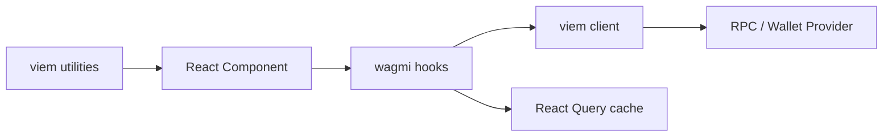

# wagmi 与 viem 常用 Hooks / API 指南

## 适用版本

你当前项目 `apps/web` 安装的是：

```json
"wagmi": "^2.19.5",
"viem": "~2.47.6"
```

本文按这两个版本来讲。

## 先说结论

### `wagmi`

`wagmi` 提供的是 React 层的 hooks，适合在组件里直接使用。

例如：

- 连接钱包
- 读取当前账号
- 切链
- 读取合约
- 调用合约写方法
- 等待交易确认

### `viem`

`viem` 本身不是 React hooks 库。

它更像底层以太坊工具箱，核心是：

- clients
- actions
- contract helpers
- utilities

所以你可以把它记成：

```text
wagmi = React hooks 层
viem = 底层链交互层
```

官方也明确说明 wagmi 是 built on viem。  
参考：<https://wagmi.sh/>  
参考：<https://viem.sh/docs/clients/intro>

## 总关系图



## 一句话理解常见组合

最常见的一套组合是：

- `useAccount` 看钱包状态
- `useConnect` 连接钱包
- `useDisconnect` 断开钱包
- `useChainId` 看当前链
- `useSwitchChain` 切链
- `useReadContract` 读合约
- `useWriteContract` 写合约
- `useWaitForTransactionReceipt` 等待交易确认
- `usePublicClient` 拿 viem 的 public client
- `useWalletClient` 拿 viem 的 wallet client
- `parseEther` / `formatEther` / `toHex` 这些来自 viem utilities

## wagmi 常用 hooks

下面这些是你做 dApp 前端最常用的一组。

### 1. `useAccount`

用途：

- 读取当前钱包地址
- 读取是否已连接
- 读取连接状态

常见写法：

```ts
import { useAccount } from "wagmi";

const { address, isConnected, status } = useAccount();
```

适合场景：

- 页面头部显示当前钱包地址
- 表单提交前判断是否已连接钱包
- 地址变化后刷新页面数据

你项目里的对应使用：

- [apps/web/src/app/eth-event-logs/eventLogComposer.tsx](/Volumes/HS-SSD-1TB/works/my-dapp-home-work-30/apps/web/src/app/eth-event-logs/eventLogComposer.tsx)
- [apps/web/src/app/eth-page/useOnChainNote.ts](/Volumes/HS-SSD-1TB/works/my-dapp-home-work-30/apps/web/src/app/eth-page/useOnChainNote.ts)

官方参考：

- `useAccount`: <https://wagmi.sh/react/api/hooks/useAccount>

### 2. `useConnect`

用途：

- 主动发起钱包连接
- 获取可用 connectors

常见写法：

```ts
import { useConnect } from "wagmi";

const connect = useConnect();

connect.mutate({ connector });
```

常见返回值：

- `connectors`
- `mutate`
- `mutateAsync`
- `isPending`
- `error`
- `reset`

适合场景：

- 自己写一个“Connect Wallet”按钮
- 自己渲染钱包连接列表

如果你已经用了 RainbowKit，很多时候不需要自己直接调 `useConnect`，因为 `ConnectButton` 已经帮你封装好了。

官方参考：

- `useConnect`: <https://wagmi.sh/react/api/hooks/useConnect>

### 3. `useDisconnect`

用途：

- 主动断开当前钱包连接

常见写法：

```ts
import { useDisconnect } from "wagmi";

const { disconnect } = useDisconnect();
```

适合场景：

- 退出钱包按钮
- 切换账户前主动断开

### 4. `useChainId`

用途：

- 获取当前钱包所在链 ID

常见写法：

```ts
import { useChainId } from "wagmi";

const chainId = useChainId();
```

适合场景：

- 判断是不是 `Sepolia`
- 页面上显示当前链
- 控制按钮是否可点击

你项目里的对应使用：

- [apps/web/src/app/eth-event-logs/eventLogComposer.tsx](/Volumes/HS-SSD-1TB/works/my-dapp-home-work-30/apps/web/src/app/eth-event-logs/eventLogComposer.tsx)

### 5. `useSwitchChain`

用途：

- 让钱包切换网络

常见写法：

```ts
import { useSwitchChain } from "wagmi";

const { switchChain } = useSwitchChain();

switchChain({ chainId: 11155111 });
```

适合场景：

- 当前链不对时，给一个“切换到 Sepolia”按钮

注意：

- 不是所有 connector / wallet 都支持程序化切链
- 有些钱包会弹确认

### 6. `useBalance`

用途：

- 查询地址余额

常见写法：

```ts
import { useBalance } from "wagmi";

const balance = useBalance({
  address,
});
```

适合场景：

- 显示用户 ETH 余额
- 表单发送前判断 gas 预算

### 7. `usePublicClient`

用途：

- 获取 viem 的 `publicClient`
- 做只读链上操作

常见写法：

```ts
import { usePublicClient } from "wagmi";

const publicClient = usePublicClient();
```

拿到后你可以调用很多 viem public actions：

- `getBalance`
- `getTransaction`
- `estimateGas`
- `readContract`
- `getBlockNumber`

你项目里的对应使用：

- [apps/web/src/app/eth-page/useOnChainNote.ts](/Volumes/HS-SSD-1TB/works/my-dapp-home-work-30/apps/web/src/app/eth-page/useOnChainNote.ts)

这个 hook 很重要，因为它经常是 wagmi 和 viem 结合点。

### 8. `useWalletClient`

用途：

- 获取 viem 的 `walletClient`
- 做签名或需要钱包权限的操作

常见写法：

```ts
import { useWalletClient } from "wagmi";

const { data: walletClient } = useWalletClient();
```

适合场景：

- 需要底层发交易
- 需要签名消息
- 不想完全用 wagmi 的封装 hook

### 9. `useReadContract`

用途：

- 读取合约 view / pure 方法

常见写法：

```ts
import { useReadContract } from "wagmi";

const result = useReadContract({
  address,
  abi,
  functionName: "balanceOf",
  args: [userAddress],
});
```

适合场景：

- 读 ERC20 余额
- 读链上配置
- 读合约状态

这是最典型的“读合约 hook”。

### 10. `useReadContracts`

用途：

- 批量读多个合约方法

常见写法：

```ts
import { useReadContracts } from "wagmi";

const result = useReadContracts({
  contracts: [
    { address, abi, functionName: "name" },
    { address, abi, functionName: "symbol" },
  ],
});
```

适合场景：

- 页面初始化要同时读很多链上字段

### 11. `useWriteContract`

用途：

- 调用合约写方法

常见写法：

```ts
import { useWriteContract } from "wagmi";

const { writeContractAsync } = useWriteContract();

const hash = await writeContractAsync({
  address,
  abi,
  functionName: "writeMessage",
  args: ["title", "content"],
});
```

适合场景：

- 调合约 `mint`
- 调合约 `approve`
- 调合约 `writeMessage`

你现在的 `eth-event-logs` 页面就是这个场景。

官方参考：

- `useWriteContract`: <https://wagmi.sh/react/api/hooks/useWriteContract>

### 12. `useSimulateContract`

用途：

- 调用写方法前先模拟
- 提前发现是否会 revert

常见写法：

```ts
import { useSimulateContract } from "wagmi";

const simulation = useSimulateContract({
  address,
  abi,
  functionName: "writeMessage",
  args: [title, content],
});
```

适合场景：

- 需要更稳的写入前校验
- 需要 gas / revert 预检查

### 13. `useSendTransaction`

用途：

- 发普通交易
- 不一定走合约 ABI

常见写法：

```ts
import { useSendTransaction } from "wagmi";

const { sendTransactionAsync } = useSendTransaction();

const hash = await sendTransactionAsync({
  to,
  value,
  data,
});
```

适合场景：

- 普通 ETH 转账
- calldata 上链

你项目里 `eth-page` 的数据上链方案就是这个方向。

位置：
[apps/web/src/app/eth-page/useOnChainNote.ts](/Volumes/HS-SSD-1TB/works/my-dapp-home-work-30/apps/web/src/app/eth-page/useOnChainNote.ts)

### 14. `useWaitForTransactionReceipt`

用途：

- 等待交易被打包确认
- 获取交易回执

常见写法：

```ts
import { useWaitForTransactionReceipt } from "wagmi";

const { data: receipt, error } = useWaitForTransactionReceipt({
  hash: txHash,
  query: {
    enabled: !!txHash,
  },
});
```

适合场景：

- 写合约后等确认
- 普通转账后等确认
- 根据 receipt 更新 UI

官方参考：

- `useWaitForTransactionReceipt`: <https://wagmi.sh/react/api/hooks/useWaitForTransactionReceipt>

### 15. `useWatchContractEvent`

用途：

- 监听链上事件

常见写法：

```ts
import { useWatchContractEvent } from "wagmi";

useWatchContractEvent({
  address,
  abi,
  eventName: "MessageWritten",
  onLogs(logs) {
    console.log(logs);
  },
});
```

适合场景：

- 实时监听事件
- 本地调试事件流

注意：

- 这个更适合实时监听
- 历史列表通常还是更适合用 The Graph

### 16. `useSignMessage`

用途：

- 让钱包签一段消息

常见写法：

```ts
import { useSignMessage } from "wagmi";

const { signMessageAsync } = useSignMessage();

const signature = await signMessageAsync({
  message: "hello",
});
```

适合场景：

- 登录签名
- off-chain 授权

### 17. `useSignTypedData`

用途：

- EIP-712 typed data 签名

适合场景：

- 更结构化的签名流程
- permit / typed data 登录

## viem 常用内容

这里要特别注意：

`viem` 常用的是 client、action、utility，不是 React hooks。

## 1. `Public Client`

这是只读客户端。

官方说明里，Public Client 提供 Public Actions，比如 `getBlockNumber`、`getBalance`。  
参考：<https://viem.sh/docs/clients/intro>

你常用的只读动作包括：

- `getBalance`
- `getTransaction`
- `getBlockNumber`
- `readContract`
- `estimateGas`

在 React 项目里，最常见获得方式不是自己 `createPublicClient`，而是：

```ts
const publicClient = usePublicClient();
```

然后再：

```ts
await publicClient.getBalance({ address });
```

## 2. `Wallet Client`

这是带钱包权限的客户端。

官方说明里，Wallet Client 提供 Wallet Actions，比如 `sendTransaction`、`signMessage`。  
参考：<https://viem.sh/docs/clients/intro>

常见用途：

- 发送交易
- 签名
- 合约写入

## 3. `readContract`

用途：

- 调用合约只读方法

官方参考：

- `readContract`: <https://viem.sh/docs/contract/readContract>

如果你不想用 wagmi 的 `useReadContract`，也可以直接用 viem：

```ts
const result = await publicClient.readContract({
  address,
  abi,
  functionName: "name",
});
```

## 4. `writeContract`

用途：

- 调用合约写方法

官方参考：

- `writeContract`: <https://viem.sh/docs/contract/writeContract>

如果你手上有 wallet client，也可以直接：

```ts
const hash = await walletClient.writeContract({
  address,
  abi,
  functionName: "writeMessage",
  args: ["title", "content"],
  account,
  chain,
});
```

但在 React 组件里，通常你会优先写成 `useWriteContract`。

## 5. `parseEther`

用途：

- 把 `"0.01"` 这样的 ETH 字符串转成 wei `bigint`

官方参考：

- `parseEther`: <https://viem.sh/docs/utilities/parseEther>

常见写法：

```ts
import { parseEther } from "viem";

const value = parseEther("0.01");
```

## 6. `formatEther`

用途：

- 把 wei `bigint` 转成人能读的 ETH 字符串

常见写法：

```ts
import { formatEther } from "viem";

const text = formatEther(balance);
```

你项目里已经在用：

- [apps/web/src/app/eth-page/useOnChainNote.ts](/Volumes/HS-SSD-1TB/works/my-dapp-home-work-30/apps/web/src/app/eth-page/useOnChainNote.ts)

## 7. `toHex`

用途：

- 把字符串或数字转成十六进制

常见写法：

```ts
import { toHex } from "viem";

const hex = toHex("hello");
```

你项目里已经在用：

- [apps/web/src/app/eth-page/useOnChainNote.ts](/Volumes/HS-SSD-1TB/works/my-dapp-home-work-30/apps/web/src/app/eth-page/useOnChainNote.ts)

## 8. `hexToString`

用途：

- 把十六进制转回字符串

常见写法：

```ts
import { hexToString } from "viem";

const text = hexToString("0x68656c6c6f");
```

你项目里已经在用：

- [apps/web/src/app/eth-page/useOnChainNote.ts](/Volumes/HS-SSD-1TB/works/my-dapp-home-work-30/apps/web/src/app/eth-page/useOnChainNote.ts)

## wagmi 和 viem 的对应关系

这个表最值得记。

| 需求 | 优先用 wagmi | 底层对应 viem |
|------|------|------|
| 看当前账号 | `useAccount` | 账户状态来自 config / connector |
| 看当前链 | `useChainId` | chain 信息 |
| 连接钱包 | `useConnect` | connector / provider |
| 断开钱包 | `useDisconnect` | connector disconnect |
| 切链 | `useSwitchChain` | wallet provider switch chain |
| 查询余额 | `useBalance` | `publicClient.getBalance` |
| 读合约 | `useReadContract` | `readContract` |
| 批量读合约 | `useReadContracts` | multicall / batched reads |
| 写合约 | `useWriteContract` | `writeContract` |
| 发普通交易 | `useSendTransaction` | `sendTransaction` |
| 等待确认 | `useWaitForTransactionReceipt` | `waitForTransactionReceipt` |
| 拿只读 client | `usePublicClient` | `Public Client` |
| 拿钱包 client | `useWalletClient` | `Wallet Client` |
| ETH 文本转 wei | 不在 wagmi | `parseEther` |
| wei 转可读 ETH | 不在 wagmi | `formatEther` |
| 字符串转 hex | 不在 wagmi | `toHex` |
| hex 转字符串 | 不在 wagmi | `hexToString` |

## 对你这个项目最实用的一套组合

### 场景 1：钱包连接页

推荐用：

- `useAccount`
- `useConnect`
- `useDisconnect`
- `useChainId`
- `useSwitchChain`

### 场景 2：普通 calldata 上链

推荐用：

- `useAccount`
- `usePublicClient`
- `useSendTransaction`
- `useWaitForTransactionReceipt`
- `toHex`
- `hexToString`
- `formatEther`

这正是你现在 [useOnChainNote.ts](/Volumes/HS-SSD-1TB/works/my-dapp-home-work-30/apps/web/src/app/eth-page/useOnChainNote.ts) 的路线。

### 场景 3：合约事件日志页

推荐用：

- `useAccount`
- `useChainId`
- `useWriteContract`
- `useWaitForTransactionReceipt`
- `useQuery` 读取 The Graph

如果还要做只读链上检查，再加：

- `usePublicClient`

### 场景 4：读合约状态

推荐用：

- `useReadContract`
- `useReadContracts`
- `usePublicClient`

## 最常见的代码模板

### 模板 1：连接钱包

```tsx
import { useConnect } from "wagmi";

export function WalletConnectList() {
  const connect = useConnect();

  return (
    <div>
      {connect.connectors.map((connector) => (
        <button
          key={connector.id}
          onClick={() => connect.mutate({ connector })}
        >
          {connector.name}
        </button>
      ))}
    </div>
  );
}
```

### 模板 2：写合约

```tsx
import { useWriteContract } from "wagmi";

function WriteMessageButton() {
  const { writeContractAsync, isPending } = useWriteContract();

  async function handleClick() {
    await writeContractAsync({
      address,
      abi,
      functionName: "writeMessage",
      args: ["title", "content"],
    });
  }

  return (
    <button disabled={isPending} onClick={handleClick}>
      Write
    </button>
  );
}
```

### 模板 3：等交易确认

```tsx
import { useWaitForTransactionReceipt } from "wagmi";

function ReceiptView({ txHash }: { txHash?: `0x${string}` }) {
  const receipt = useWaitForTransactionReceipt({
    hash: txHash,
    query: {
      enabled: !!txHash,
    },
  });

  if (receipt.isPending) return <div>Confirming...</div>;
  if (receipt.isError) return <div>{receipt.error.message}</div>;
  if (!receipt.data) return null;

  return <div>Confirmed in block {receipt.data.blockNumber.toString()}</div>;
}
```

### 模板 4：用 viem utilities 做金额转换

```ts
import { parseEther, formatEther } from "viem";

const weiValue = parseEther("0.01");
const displayValue = formatEther(weiValue);
```

## 常见误区

### 误区 1：把 wagmi 和 viem 当成互斥关系

不是二选一。

更准确的理解是：

```text
wagmi hooks 用来写 React 组件
viem utilities / client 用来做底层链操作
```

### 误区 2：以为 viem 有 React hooks

`viem` 本身没有像 wagmi 这样的一整套 React hooks。

它更多是：

- client
- contract API
- utilities

### 误区 3：所有链上读写都只用一个 hook

其实不同场景建议不同：

- 看钱包状态：`useAccount`
- 读合约：`useReadContract`
- 写合约：`useWriteContract`
- 等确认：`useWaitForTransactionReceipt`
- 复杂只读：`usePublicClient`

## 对你当前学习顺序的建议

如果你是按实战来学，建议顺序是：

1. 先学 `useAccount`
2. 再学 `useChainId`
3. 再学 `useConnect`
4. 再学 `useWriteContract`
5. 再学 `useWaitForTransactionReceipt`
6. 再学 `usePublicClient`
7. 再补 `parseEther`、`formatEther`、`toHex`、`hexToString`

这样最贴近你现在的作业路径。

## 官方参考

- wagmi 首页  
  <https://wagmi.sh/>
- wagmi `useConnect`  
  <https://wagmi.sh/react/api/hooks/useConnect>
- wagmi `useWriteContract`  
  <https://wagmi.sh/react/api/hooks/useWriteContract>
- wagmi `useWaitForTransactionReceipt`  
  <https://wagmi.sh/react/api/hooks/useWaitForTransactionReceipt>
- viem Clients  
  <https://viem.sh/docs/clients/intro>
- viem `readContract`  
  <https://viem.sh/docs/contract/readContract>
- viem `writeContract`  
  <https://viem.sh/docs/contract/writeContract>
- viem `parseEther`  
  <https://viem.sh/docs/utilities/parseEther>
