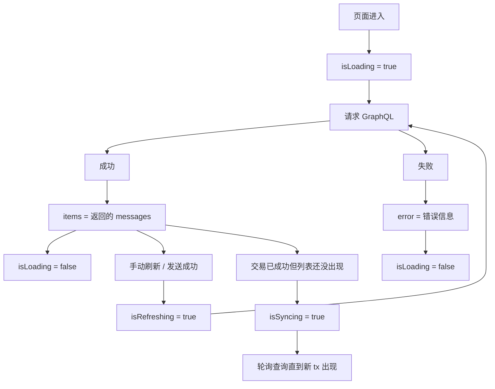

这几个 `useState` 就是在维护“历史列表请求过程”的状态。  
你可以把它理解成：**这个 hook 自己在管理一个小状态机。**

---

## 1. `items`

```ts
const [items, setItems] = useState<MessageHistoryItem[]>([]);
```

意思：

- `items` = 当前查到的历史消息列表
- 初始值是空数组 `[]`
- `setItems(...)` 用来更新列表数据

比如 GraphQL 查询成功后，会把返回的 `messages` 填进去。

你可以把它理解成：

```ts
items = 页面下方要渲染的历史记录
```

---

## 2. `isLoading`

```ts
const [isLoading, setIsLoading] = useState(true);
```

意思：

- 当前是不是“首次加载中”
- 初始值是 `true`，因为页面一进来通常就要先查一次数据

适合控制：

- 首屏 loading skeleton
- 初次进入页面的加载状态

你可以理解成：

```ts
isLoading = 第一次加载数据，还没拿到结果
```

---

## 3. `isRefreshing`

```ts
const [isRefreshing, setIsRefreshing] = useState(false);
```

意思：

- 当前是不是“刷新中”
- 和 `isLoading` 不一样，它更偏向“已有数据后的再次刷新”

例如：

- 页面已经有历史列表了
- 用户又点了 Refresh
- 或者发送成功后你触发一次重拉

这时候就不想全屏 loading，而是想显示一个轻量的“正在刷新”。

你可以理解成：

```ts
isRefreshing = 已经有旧数据了，现在在后台重新拉最新数据
```

---

## 4. `isSyncing`

```ts
const [isSyncing, setIsSyncing] = useState(false);
```

这个是你这页特有的，非常重要。

意思：

- 交易已经成功了
- 但 The Graph 可能还没把新事件索引进去
- 所以页面处于“链上成功，但索引还在追”的状态

适合控制：

- `The Graph syncing...`
- 轮询等待新消息出现

你可以理解成：

```ts
isSyncing = 不是请求失败，而是 The Graph 还没同步到最新事件
```

这个状态不是通用前端 loading，而是 **The Graph 索引延迟状态**。

---

## 5. `error`

```ts
const [error, setError] = useState<string | undefined>(undefined);
```

意思：

- 当前请求有没有错误信息
- 如果失败，就把错误文本存进来
- 如果成功，就清空

适合展示：

- endpoint 没配置
- GraphQL 请求失败
- 返回 errors
- 网络异常

你可以理解成：

```ts
error = 当前历史列表查询失败的原因
```

---

## 6. `retrySeed`

```ts
const [retrySeed, setRetrySeed] = useState(0);
```

这个是一个“强制触发重新执行 effect”的计数器。

因为你的 `useEffect` 依赖里一般会放：

```ts
[expectedTxHash, pageSize, refreshKey, retrySeed]
```

只要 `retrySeed` 变了，`useEffect` 就会重新执行一次。

例如：

```ts
function refetch() {
  setRetrySeed((value) => value + 1);
}
```

每次 `+1`，effect 就重新跑一次，相当于手动刷新。

你可以理解成：

```ts
retrySeed = 手动重试 / 强制重拉的触发器
```

它本身没业务含义，只是用来“让 effect 再跑一遍”。

---

# 整体怎么理解

这 6 个状态合起来，就是这个 hook 的“数据 + 请求过程”：

```ts
items         // 查到的历史数据
isLoading     // 首次加载中
isRefreshing  // 后续刷新中
isSyncing     // The Graph 还在追最新链上数据
error         // 查询失败信息
retrySeed     // 手动触发重新查询
```

---

# 你可以把它想成这个流程



---

# 一句话速记

- `items`：数据本体
- `isLoading`：第一次加载
- `isRefreshing`：后续刷新
- `isSyncing`：The Graph 追索引
- `error`：错误信息
- `retrySeed`：强制重跑查询

如果你愿意，我下一步可以直接把 [useMessageHistory.ts](/Volumes/HS-SSD-1TB/works/my-dapp-home-work-30/apps/web/src/app/eth-event-logs/useMessageHistory.ts) 从上到下逐段给你讲一遍。