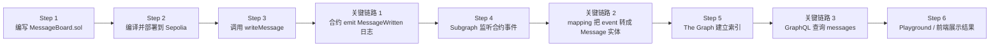
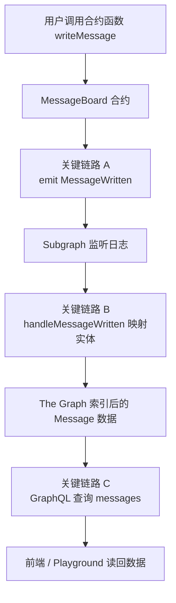
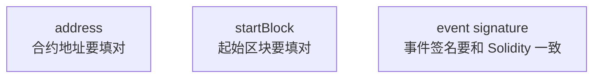

# 4-4 作业实操教程：日志上链 + The Graph 读回数据

这份教程是按你当前仓库结构写的，目标是完成作业里的这两项：

- `5-1` 写一个通过日志记录链上数据的合约，并部署到测试链
- `5-2` 使用 The Graph 把这些日志数据读回来

这次我们不改你现在的 `packages/contracts/docs/4-4作业.md` 原文，而是在旁边单独补一份可执行教程。

## 1. 先理解这题到底要做什么

你仓库里现在已经有一套“把文本放进交易 calldata”的方案，代码在：

- `apps/web/src/app/eth-page`
- `apps/web/src/app/eth-local-page`

那是第 `4` 题的路线。

第 `5` 题要换一种方式：

- 不把数据放进普通交易的 `input`
- 而是写一个合约
- 用户调用合约函数
- 合约通过 `event` 把数据打到链上日志里
- 再让 The Graph 监听这个事件并建立索引
- 最后用 GraphQL 把数据查询回来

一句话概括：

`用户调用合约 -> 合约 emit 日志 -> The Graph 索引日志 -> 你用 GraphQL 查询日志数据`

## 2. 建议你最终交付的成果

建议你把作业做成下面这套最小闭环：

1. 一个日志合约 `MessageBoard.sol`
2. 合约成功部署到 `Sepolia`
3. 你手动调用一次 `writeMessage`
4. 一个 Subgraph 工程
5. 能在 The Graph Playground 里查到 `messages`
6. 最后截图或录屏证明：
   - Sepolia 合约地址
   - 成功写入的交易 hash
   - The Graph 查询结果

## 3. 这个仓库里你已经可以直接复用的部分

你当前项目已经有这些基础：

- `packages/contracts/hardhat.config.ts`
  已经配好了 `sepolia` 网络读取 `SEPOLIA_RPC_URL` 和 `SEPOLIA_PRIVATE_KEY`
- `packages/contracts/package.json`
  已经有 `compile`、`test`、`node`
- `packages/contracts/ignition/modules/Counter.ts`
  可以直接照着新增一个自己的部署模块

所以这题不用重新搭 Hardhat，只需要在现有目录里继续加文件。

## 4. 推荐的目录安排

建议你把这次作业相关文件放成这样：

```text
packages/contracts/
├── contracts/
│   └── MessageBoard.sol
├── ignition/modules/
│   └── MessageBoard.ts
├── docs/
│   └── 4-4作业-TheGraph实操教程.md
└── subgraph/
    ├── schema.graphql
    ├── subgraph.yaml
    ├── package.json
    ├── abis/
    │   └── MessageBoard.json
    └── src/
        └── message-board.ts
```

`subgraph/` 不一定非要放这里，但放在 `packages/contracts` 下面最顺手。

## 5. Step 0：准备环境变量

先确保你本地有这几个值：

```bash
SEPOLIA_RPC_URL=
SEPOLIA_PRIVATE_KEY=
NEXT_PUBLIC_ALCHEMY_API_KEY=
```

说明：

- `SEPOLIA_RPC_URL`
  给 Hardhat 部署合约用
- `SEPOLIA_PRIVATE_KEY`
  部署钱包私钥
- `NEXT_PUBLIC_ALCHEMY_API_KEY`
  你前端现有 ETH 相关功能已经在用，后续如果你想把 The Graph 查询页接到前端，也会方便很多

注意两点：

- 部署钱包里需要有少量 `Sepolia ETH`
- 私钥不要提交到 git

## 6. Step 1：先写日志合约

在 `packages/contracts/contracts/MessageBoard.sol` 新建合约：

```solidity
// SPDX-License-Identifier: MIT
pragma solidity ^0.8.28;

contract MessageBoard {
  event MessageWritten(
    address indexed author,
    string title,
    string content,
    uint256 createdAt
  );

  function writeMessage(
    string calldata title,
    string calldata content
  ) external {
    require(bytes(title).length > 0, "title is empty");
    require(bytes(content).length > 0, "content is empty");

    emit MessageWritten(msg.sender, title, content, block.timestamp);
  }
}
```

为什么这样设计：

- 这题重点是“日志方式触发”
- 所以我们把核心数据都放进 `event`
- 合约本身不做复杂 storage
- 这样 The Graph 的索引路径最清楚

这里的 `indexed author` 很重要，因为后面你可以按作者地址过滤。

## 7. Step 2：写部署模块

在 `packages/contracts/ignition/modules/MessageBoard.ts` 新建：

```ts
import { buildModule } from "@nomicfoundation/hardhat-ignition/modules";

export default buildModule("MessageBoardModule", (m) => {
  const messageBoard = m.contract("MessageBoard");

  return { messageBoard };
});
```

这一步的作用很简单：

- 让 Hardhat Ignition 知道要部署哪个合约
- 后面可以直接执行部署命令

## 8. Step 3：先本地编译，确认合约没问题

在仓库根目录执行：

```bash
cd packages/contracts
pnpm compile
```

如果编译成功，你通常会得到 ABI 和 artifacts。

后面给 The Graph 用的 ABI，通常可以从这里拷贝：

```text
packages/contracts/artifacts/contracts/MessageBoard.sol/MessageBoard.json
```

如果你想更稳一点，也可以顺手加一个本地测试，验证 `writeMessage` 会不会发出事件。但这一步不是作业必须项。

## 9. Step 4：部署到 Sepolia

继续在 `packages/contracts` 下执行：

```bash
pnpm hardhat ignition deploy --network sepolia ignition/modules/MessageBoard.ts
```

部署成功后，记下这两个东西：

1. 合约地址 `contract address`
2. 部署所在区块 `startBlock`

后面写 `subgraph.yaml` 时会用到。

如果终端没有明确打印 `startBlock`，你可以：

1. 复制部署交易 hash
2. 去 `Sepolia Etherscan` 打开这笔交易
3. 看它所在的区块号

## 10. Step 5：往合约里写一条测试数据

这一步的目标不是“优雅”，而是“先把作业跑通”。

最省事的做法有两个：

1. 用 Remix 的 `At Address` 方式连接你刚部署的合约，然后调用 `writeMessage`
2. 合约验证后，用 Etherscan 的 `Write Contract` 页面调用 `writeMessage`

建议你先用下面这组测试数据：

- `title`: `4-4 homework`
- `content`: `Hello The Graph from Sepolia`

调用成功后，记下：

- 交易 hash `0x521c74e0f5542352f28424791db14d63cdb2fcd9e67a8f4ff094f9a386d737da`
- 合约地址 `0x20CD59B47e1D1a6e8f86Ce57dDEDfdEd9c7566F8`

然后去 Etherscan 的 `Logs` 看一下，确认确实发出了 `MessageWritten` 事件。

做到这一步，`5-1` 基本就完成了。

## 11. Step 6：初始化 The Graph 的 subgraph 工程

在 `packages/contracts` 下创建 `subgraph` 目录：

```bash
mkdir -p subgraph
cd subgraph
pnpm init
pnpm add -D @graphprotocol/graph-cli
pnpm add @graphprotocol/graph-ts
```

然后在 The Graph Studio 上先创建一个 subgraph，比如叫：

```text
message-board-sepolia-demo
```

接着你需要在本地做认证。大致流程是：

1. 在 Studio 创建 subgraph
2. 复制 deploy key
3. 本地执行 `graph auth`

示例命令：

```bash
pnpm exec graph auth --studio <你的部署密钥>
```

`<你的部署密钥>` 需要从 Studio 页面获取，不要写死进仓库。

## 12. Step 7：准备 ABI 给 The Graph

从 Hardhat 编译结果里拷贝 ABI：

```text
packages/contracts/artifacts/contracts/MessageBoard.sol/MessageBoard.json
```

把里面的 ABI 提取出来，保存成：

```text
packages/contracts/subgraph/abis/MessageBoard.json
```

最简单的做法是：

- 打开 Hardhat 生成的 `MessageBoard.json`
- 找到里面的 `abi` 数组
- 只把 ABI 数组内容放进 `subgraph/abis/MessageBoard.json`

不要把整个 artifact 文件原样丢进去，The Graph 这里通常只需要 ABI。

## 13. Step 8：写 `schema.graphql`

在 `packages/contracts/subgraph/schema.graphql` 写：

```graphql
type Message @entity(immutable: true) {
  id: ID!
  author: Bytes!
  title: String!
  content: String!
  createdAt: BigInt!
  blockNumber: BigInt!
  blockTimestamp: BigInt!
  transactionHash: Bytes!
}
```

这里这样设计有几个好处：

- `id` 用于唯一标识每条日志
- `author`、`title`、`content` 对应事件参数
- `blockTimestamp` 和 `transactionHash` 方便你做作业展示

## 14. Step 9：写 `subgraph.yaml`

在 `packages/contracts/subgraph/subgraph.yaml` 写：

```yaml
specVersion: 1.3.0
schema:
  file: ./schema.graphql

dataSources:
  - kind: ethereum
    name: MessageBoard
    network: sepolia
    source:
      address: "0x你的合约地址"
      abi: MessageBoard
      startBlock: 0
    mapping:
      kind: ethereum/events
      apiVersion: 0.0.9
      language: wasm/assemblyscript
      entities:
        - Message
      abis:
        - name: MessageBoard
          file: ./abis/MessageBoard.json
      eventHandlers:
        - event: MessageWritten(indexed address,string,string,uint256)
          handler: handleMessageWritten
      file: ./src/message-board.ts
```

这里有两个地方你必须手动替换：

- `address`
  换成你部署到 Sepolia 的真实合约地址
- `startBlock`
  换成部署区块号

`startBlock` 很重要：

- 配小了也能跑，只是索引更慢
- 配成部署区块会更合适

## 15. Step 10：写 mapping

在 `packages/contracts/subgraph/src/message-board.ts` 写：

```ts
import { MessageWritten as MessageWrittenEvent } from "../generated/MessageBoard/MessageBoard";
import { Message } from "../generated/schema";

export function handleMessageWritten(event: MessageWrittenEvent): void {
  let entity = new Message(
    event.transaction.hash.toHexString() + "-" + event.logIndex.toString(),
  );

  entity.author = event.params.author;
  entity.title = event.params.title;
  entity.content = event.params.content;
  entity.createdAt = event.params.createdAt;
  entity.blockNumber = event.block.number;
  entity.blockTimestamp = event.block.timestamp;
  entity.transactionHash = event.transaction.hash;

  entity.save();
}
```

这里的 `id` 组合方式很常见：

- 单独用 `transaction hash` 不够，因为一笔交易可能发多个日志
- 所以再拼一个 `logIndex`
- 这样基本就唯一了

## 16. Step 11：写 `subgraph/package.json`

为了后面命令更顺手，可以在 `packages/contracts/subgraph/package.json` 写成这样：

```json
{
  "name": "message-board-subgraph",
  "private": true,
  "scripts": {
    "codegen": "graph codegen",
    "build": "graph build",
    "deploy": "graph deploy --studio message-board-sepolia-demo"
  },
  "dependencies": {
    "@graphprotocol/graph-ts": "latest"
  },
  "devDependencies": {
    "@graphprotocol/graph-cli": "latest"
  }
}
```

注意把这里的 `message-board-sepolia-demo` 改成你在 Studio 真正创建的 subgraph 名字。

## 17. Step 12：生成代码并构建

在 `packages/contracts/subgraph` 执行：

```bash
pnpm install
pnpm codegen
pnpm build
```

如果这一步报错，优先检查这几项：

1. ABI 文件是不是只保留了 `abi` 数组
2. 事件签名是不是和 Solidity 完全一致
3. `subgraph.yaml` 里的 `address` 和 `startBlock` 有没有替换
4. `network` 是否还是 `sepolia`

## 18. Step 13：部署 subgraph

在 `packages/contracts/subgraph` 执行：

```bash
pnpm deploy
```

如果你没有在 `package.json` 里配脚本，也可以直接执行：

```bash
pnpm exec graph deploy --studio message-board-sepolia-demo
```

部署完成后，Studio 会给你一个查询入口。

## 19. Step 14：在 The Graph Playground 查询数据

先用这条查询验证最基本结果：

```graphql
{
  messages(first: 5, orderBy: blockTimestamp, orderDirection: desc) {
    id
    author
    title
    content
    createdAt
    blockNumber
    transactionHash
  }
}
```

如果你刚才写入的是：

- `title = 4-4 homework`
- `content = Hello The Graph from Sepolia`

那么查询结果里应该能看到这条数据。

做到这里，`5-2` 就完成了。

## 20. 你答辩时可以怎么讲

可以直接按这条线讲：

1. 我先写了一个 `MessageBoard` 合约
2. 用户调用 `writeMessage`
3. 合约不把正文存进 storage，而是通过 `MessageWritten` 事件写入链上日志
4. The Graph 监听这个事件并建立索引
5. 最后我通过 GraphQL 查询 `messages`，把链上日志数据读回来了

老师一般会继续问两个问题：

### 问题 1：为什么这里更适合 The Graph？

回答：

因为 The Graph 特别适合做基于事件日志的索引。它不需要我自己扫链、解日志、存数据库，只要监听 `event` 就能把结构化数据整理成 GraphQL 查询接口。

### 问题 2：为什么这里不用合约 storage？

回答：

这题的重点是“日志方式触发”。所以我故意把核心业务数据放在事件里，让 The Graph 直接索引日志；storage 不是不行，只是会让这题的重点变得不明显。

## 21. 最容易卡住的地方

### 1. 合约部署成功了，但 Graph 查不到

通常检查这几项：

- `subgraph.yaml` 的 `address` 填错
- `startBlock` 填错
- 你部署后还没真正调用过 `writeMessage`
- 事件签名写错

### 2. Etherscan 里有交易，但没看到日志

通常是：

- 调用的不是 `writeMessage`
- 交易失败了
- 你看的不是那笔成功交易

### 3. The Graph build 报 ABI 错

通常是：

- 你把 Hardhat 的完整 artifact 文件直接复制过去了
- 而不是只放 ABI

### 4. 部署到 Sepolia 时报私钥或 RPC 错误

检查：

- `SEPOLIA_RPC_URL`
- `SEPOLIA_PRIVATE_KEY`
- 钱包里是否真的有测试币

## 22. 作业验收清单

你可以按这个 checklist 自查：

- [ ] `MessageBoard.sol` 已完成
- [ ] `MessageBoard.ts` Ignition 模块已完成
- [ ] 合约已部署到 `Sepolia`
- [ ] 至少成功调用过一次 `writeMessage`
- [ ] 在 Etherscan 能看到 `MessageWritten` 日志
- [ ] `subgraph.yaml` 已填写真实 `address`
- [ ] `subgraph.yaml` 已填写真实 `startBlock`
- [ ] `graph codegen` 成功
- [ ] `graph build` 成功
- [ ] `graph deploy` 成功
- [ ] GraphQL 查询能返回 `messages`

## 23. 如果你还想把它接回你当前前端

你这个仓库已经有 `apps/web/src/app/eth-page` 的 ETH 页面了。

你下一步完全可以再加一个页面，比如：

```text
apps/web/src/app/eth-graph-page/page.tsx
```

这个页面只做两件事：

1. 请求 The Graph 的 GraphQL 接口
2. 把 `messages` 列表渲染出来

这样你这次作业就会从：

- “会部署合约”

升级成：

- “合约能发日志”
- “The Graph 能索引”
- “前端还能展示索引结果”

这会让你的作业完整度高很多。

## 24. 建议你的实际执行顺序

如果你想少走弯路，按这个顺序来：

1. 先写 `MessageBoard.sol`
2. 本地 `pnpm compile`
3. 部署到 `Sepolia`
4. 手动调用一次 `writeMessage`
5. 去 Etherscan 确认日志真的出来了
6. 再做 `subgraph/`
7. `codegen -> build -> deploy`
8. 最后用 GraphQL 查结果

不要一上来就先搞 The Graph。

因为如果链上连日志都还没发成功，后面所有排查都会变得很乱。

## 25. 参考资料

下面这些是我写这份教程时对照过的官方资料：

- The Graph Quick Start: `https://thegraph.com/docs/en/quick-start/`
- The Graph Subgraph Manifest: `https://thegraph.com/docs/en/subgraphs/developing/creating/subgraph-manifest/`
- Hardhat Getting Started: `https://hardhat.org/docs/getting-started`

如果你愿意，我下一步可以继续直接帮你补这套最小代码骨架：

- `packages/contracts/contracts/MessageBoard.sol`
- `packages/contracts/ignition/modules/MessageBoard.ts`
- `packages/contracts/subgraph/*`

这样你就不是只有教程，而是仓库里已经有一套可继续填地址和部署的作业模板了。


这份教程可以压成一条很清晰的主链路：

`写合约 -> 部署到 Sepolia -> 手动调用函数 -> 合约 emit 事件日志 -> The Graph 监听并索引 -> GraphQL 查询读回数据`

如果再展开成你答辩或复习时最好记的 8 步，就是：

1. 先写 `MessageBoard.sol`  
核心不是存 storage，而是 `emit MessageWritten(...)`。

2. 再写部署模块 `MessageBoard.ts`  
让 Hardhat Ignition 知道要部署哪个合约。

3. 本地编译  
拿到 ABI，确认合约没问题。

4. 部署到 `Sepolia`  
记住两个关键信息：`合约地址` 和 `startBlock`。

5. 手动调用一次 `writeMessage`  
目的是先在链上真的打一条日志。

6. 去 Etherscan 看日志  
确认交易成功，而且 `MessageWritten` 事件确实发出来了。

7. 搭 Subgraph  
准备 4 个关键文件：
`ABI -> schema.graphql -> subgraph.yaml -> mapping.ts`

8. `codegen -> build -> deploy -> GraphQL 查询`  
最后在 Playground 里查 `messages`，把链上日志读回来。

你可以把它记成一句口诀：

`链上先发日志，Graph 来做索引，最后 GraphQL 读回。`

再帮你压成“文件职责链”方便记忆：

`MessageBoard.sol`：负责发事件  
`MessageBoard.ts`：负责部署  
`MessageBoard.json`：给 The Graph 认识合约  
`schema.graphql`：定义要存成什么数据  
`subgraph.yaml`：告诉 The Graph 去哪里监听、从哪一块开始监听  
`message-board.ts`：把事件字段映射成实体  
`GraphQL`：把结果查出来

最容易混的点，其实只有一个核心判断：

`第 5 题不是“把数据写进合约存储再读”，而是“把数据写进事件日志，再由 The Graph 建索引来读”。`

如果你愿意，我下一步可以继续把这份总结直接整理成“超短背诵版”或者“答辩发言版”。


下面这版可以直接放进 Markdown 文档里，既有链路图，也把关键链路和关键步骤标出来了。

## The Graph 作业总链路



## 关键链路拆解



## 关键步骤标记

1. `Step 1：写合约`
   目标：不是写 storage，而是定义 `event MessageWritten(...)` 并在 `writeMessage` 里 `emit`。

2. `Step 2：部署合约`
   目标：把合约部署到 `Sepolia`，记住两个关键值：
   - `address`
   - `startBlock`

3. `Step 3：手动写入一条消息`
   目标：真实触发一次 `writeMessage`，让链上产生事件日志。

4. `关键链路 1：链上日志产生`
   核心：`用户调用 -> 合约 emit event`
   这是整个作业的起点。

5. `Step 4：配置 Subgraph`
   关键文件：
   - `abis/MessageBoard.json`
   - `schema.graphql`
   - `subgraph.yaml`
   - `src/message-board.ts`

6. `关键链路 2：事件转实体`
   核心：`event MessageWritten -> Message entity`
   也就是 mapping 里把事件参数存成结构化数据。

7. `Step 5：构建并部署 Subgraph`
   执行链路：
   - `graph codegen`
   - `graph build`
   - `graph deploy`

8. `关键链路 3：查询读回`
   核心：`The Graph 索引结果 -> GraphQL -> messages`
   这一步说明你已经把链上日志成功“读回来”了。

## 最好记的一句话

```text
用户调用合约
-> 合约 emit 日志
-> The Graph 监听日志
-> mapping 转成实体
-> GraphQL 查询读回
```

## 最关键的 3 个配置点



如果你要，我可以下一步直接帮你把这段整理成适合放进 [4-4作业-TheGraph实操教程.md](/Volumes/HS-SSD-1TB/works/my-dapp-home-work-30/packages/contracts/docs/4-4作业-TheGraph实操教程.md) 的“最终版 Markdown 小节”。