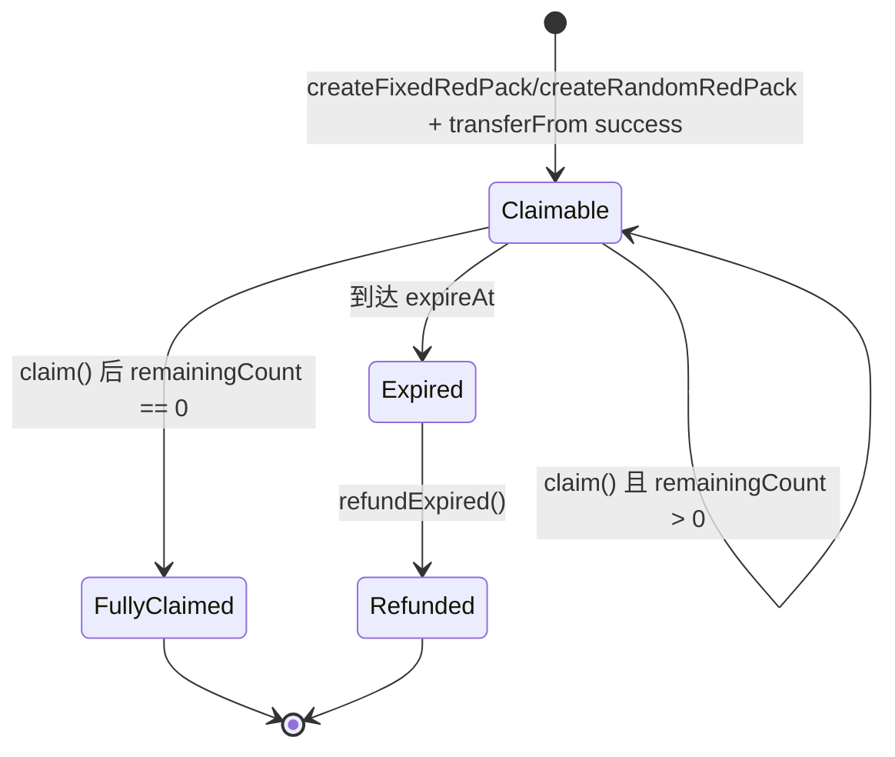
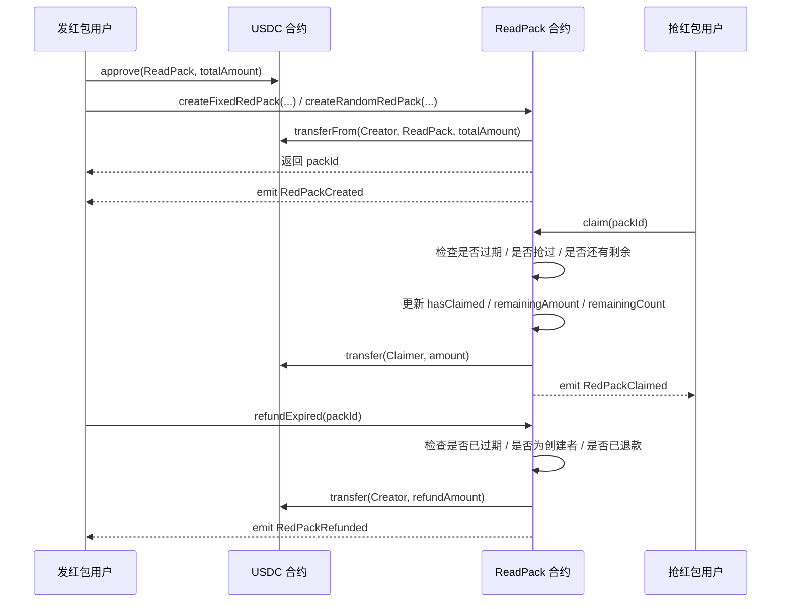

# ReadPack USDC 红包教程（Sepolia）

这篇教程的目标是：基于当前仓库的 `Hardhat + Solidity + viem` 环境，实现一个部署在 **Ethereum Sepolia** 上的 **USDC 红包合约**。

这里顺手说明一下命名：红包更常见的英文会写成 `RedPack` 或 `RedPacket`，但你当前仓库里的文件名已经是 [`ReadPack.sol`](../contracts/ReadPack.sol)，所以文档里继续沿用这个名字，避免和现有目录脱节。

## 1. 先确认这次的目标版本

这次和 ETH 红包最大的区别有 4 个：

1. 红包资产从 `ETH` 改成了 `USDC`。
2. 创建红包时，不再通过 `msg.value` 打钱，而是走 `approve + transferFrom`。
3. USDC 在 Ethereum Sepolia 上是 **6 位小数**，所以链上金额单位不是 `wei`，而是 `10^-6 USDC`。
4. 合约部署到 `Sepolia`，但发交易 gas 依然要用 `Sepolia ETH` 支付。

## 2. Sepolia 上的 USDC 信息

根据 Circle 官方文档，**Ethereum Sepolia 上的官方 USDC 地址**是：

```text
0x1c7D4B196Cb0C7B01d743Fbc6116a902379C7238
```

参考资料：

- [Circle Docs: USDC Contract Addresses](https://developers.circle.com/stablecoins/usdc-contract-addresses)
- [Circle: USDC on Ethereum](https://www.circle.com/multi-chain-usdc/ethereum)
- [Circle Faucet](https://faucet.circle.com/)

说明：

- 想测试发红包，你的钱包里需要两种资产：
  - `Sepolia ETH`：付 gas
  - `USDC on Sepolia`：真正被装进红包的代币
- 测试用 USDC 可以通过 Circle Faucet 申请，网络选择 `Ethereum Sepolia`。

## 3. 这次的业务需求

一个基础版 USDC 红包合约，建议先支持这 6 个能力：

1. 创建红包时，把 USDC 从用户钱包转进合约。
2. 红包有份数，比如 `10 USDC` 分成 `5` 份。
3. 支持两种模式：
   - `固定金额红包`
   - `随机金额红包`
4. 每个地址只能领取一次。
5. 红包过期后，创建者可以取回剩余 USDC。
6. 合约构造时绑定 Sepolia 的 USDC 合约地址。

## 4. 先想清楚链上要存什么

红包最核心的状态不是“谁抢到了多少”，而是“还剩多少可领的额度”。

所以一份红包至少要记录这些字段：

```solidity
struct Pack {
    address creator;
    uint256 totalAmount;
    uint256 remainingAmount;
    uint256 totalCount;
    uint256 remainingCount;
    uint256 amountPerClaim;
    uint256 expireAt;
    PackMode mode;
    bool refunded;
}
```

每个字段的职责如下：

- `creator`：谁发的红包。
- `totalAmount`：红包初始总 USDC 数量。
- `remainingAmount`：当前剩余未领取的 USDC 数量。
- `totalCount`：总份数。
- `remainingCount`：剩余可领取份数。
- `amountPerClaim`：固定红包每份金额；随机红包填 `0`。
- `expireAt`：过期时间。
- `mode`：固定红包 / 随机红包。
- `refunded`：是否已经退款。

除此之外，还要额外记录“某个地址是否已经领过这个红包”：

```solidity
mapping(uint256 => mapping(address => bool)) public hasClaimed;
```

## 5. USDC 红包和 ETH 红包的实现差异

如果你之前写的是 ETH 红包，这里有三个必须改掉的点：

### 5.1 创建红包不再是 payable

ETH 红包通常是：

```solidity
function createRedPack(...) external payable
```

但 USDC 红包不是把 ETH 打进合约，而是让用户先授权，再由合约拉取代币，所以函数应该改成普通函数：

```solidity
function createFixedRedPack(...) external returns (uint256 packId)
```

### 5.2 资金进入合约的方式改成 transferFrom

ETH 红包靠 `msg.value` 入账，USDC 红包则要这样走：

1. 用户先在钱包里执行 `approve(ReadPack, totalAmount)`。
2. 创建红包时，合约调用：

```solidity
usdc.transferFrom(msg.sender, address(this), totalAmount);
```

### 5.3 发红包/退款不再用 call{value: ...}

ETH 红包里常见：

```solidity
(bool success, ) = payable(msg.sender).call{value: amount}("");
```

USDC 红包要改成：

```solidity
usdc.transfer(msg.sender, amount);
```

## 6. 金额单位一定要统一

Sepolia 上的 USDC 是 6 位小数，所以：

- `1 USDC = 1_000_000`
- `10 USDC = 10_000_000`
- `0.5 USDC = 500_000`

也就是说，合约里所有 `uint256 amount` 都应该理解成 **USDC 最小单位**，不是人类阅读的浮点数。

例如：

```solidity
uint256 totalAmount = 10 * 10 ** 6; // 10 USDC
```

## 7. 推荐的接口设计

推荐把接口拆成下面几个函数：

- `createFixedRedPack(uint256 totalAmount, uint256 totalCount, uint256 expireAt)`
- `createRandomRedPack(uint256 totalAmount, uint256 totalCount, uint256 expireAt)`
- `claim(uint256 packId)`
- `refundExpired(uint256 packId)`
- `getPack(uint256 packId)`

这样设计的好处是：

- 固定红包和随机红包的参数清晰。
- 不依赖 `msg.value`，前端更容易对接 ERC-20。
- 更符合 USDC 红包的真实调用方式。

## 8. 完整示例合约（USDC 版）

下面这份代码就是一个可直接落到 `ReadPack.sol` 的基础版结构。

```solidity
// SPDX-License-Identifier: MIT
pragma solidity ^0.8.28;

// 这里只定义最小可用接口，避免额外依赖 OpenZeppelin
interface IERC20 {
    function transfer(address to, uint256 value) external returns (bool);

    function transferFrom(
        address from,
        address to,
        uint256 value
    ) external returns (bool);
}

contract ReadPack {
    // 红包类型：固定金额 / 随机金额
    enum PackMode {
        Fixed,
        Random
    }

    // 单个红包的核心状态
    struct Pack {
        address creator; // 红包创建者
        uint256 totalAmount; // 红包初始总金额（USDC 最小单位）
        uint256 remainingAmount; // 当前剩余未领取金额
        uint256 totalCount; // 红包总份数
        uint256 remainingCount; // 剩余可领取份数
        uint256 amountPerClaim; // 固定红包每份金额，随机红包时为 0
        uint256 expireAt; // 红包过期时间戳
        PackMode mode; // 红包模式
        bool refunded; // 是否已经执行过退款
    }

    // Sepolia USDC 是 6 位小数，方便前端和测试统一认知
    uint8 public constant USDC_DECIMALS = 6;

    // 构造函数里注入 USDC 合约地址，部署 Sepolia 时传官方地址
    IERC20 public immutable usdc;

    // 自增红包 ID，从 1 开始更直观
    uint256 public nextPackId = 1;

    // packId => 红包详情
    mapping(uint256 => Pack) private packs;
    // packId => user => 是否已经领取过
    mapping(uint256 => mapping(address => bool)) public hasClaimed;

    // 创建红包事件，便于前端或索引服务订阅
    event RedPackCreated(
        uint256 indexed packId,
        address indexed creator,
        uint256 totalAmount,
        uint256 totalCount,
        PackMode mode,
        uint256 expireAt
    );

    event RedPackClaimed(
        uint256 indexed packId,
        address indexed claimer,
        uint256 amount,
        uint256 remainingAmount,
        uint256 remainingCount
    );

    event RedPackRefunded(
        uint256 indexed packId,
        address indexed creator,
        uint256 refundAmount
    );

    constructor(address usdcAddress) {
        require(usdcAddress != address(0), "Invalid USDC address");
        usdc = IERC20(usdcAddress);
    }

    // 创建固定金额红包：totalAmount 必须能被 totalCount 整除
    function createFixedRedPack(
        uint256 totalAmount,
        uint256 totalCount,
        uint256 expireAt
    ) external returns (uint256 packId) {
        require(totalAmount > 0, "Amount must be greater than 0");
        require(totalCount > 0, "Count must be greater than 0");
        require(expireAt > block.timestamp, "expireAt must be in the future");
        require(
            totalAmount % totalCount == 0,
            "Amount must be divisible by totalCount"
        );

        // 先把 USDC 从创建者钱包转进合约
        require(
            usdc.transferFrom(msg.sender, address(this), totalAmount),
            "USDC transferFrom failed"
        );

        uint256 amountPerClaim = totalAmount / totalCount;

        packId = _createPack(
            msg.sender,
            totalAmount,
            totalCount,
            amountPerClaim,
            expireAt,
            PackMode.Fixed
        );
    }

    // 创建随机金额红包：至少要保证每份还能分到 1 个最小单位
    function createRandomRedPack(
        uint256 totalAmount,
        uint256 totalCount,
        uint256 expireAt
    ) external returns (uint256 packId) {
        require(totalAmount > 0, "Amount must be greater than 0");
        require(totalCount > 0, "Count must be greater than 0");
        require(expireAt > block.timestamp, "expireAt must be in the future");
        require(
            totalAmount >= totalCount,
            "Need at least 1 unit for each claim"
        );

        // 先把 USDC 从创建者钱包转进合约
        require(
            usdc.transferFrom(msg.sender, address(this), totalAmount),
            "USDC transferFrom failed"
        );

        packId = _createPack(
            msg.sender,
            totalAmount,
            totalCount,
            0,
            expireAt,
            PackMode.Random
        );
    }

    // 领取红包：一个地址只能领一次，创建者本人不能领取
    function claim(uint256 packId) external returns (uint256 amount) {
        Pack storage pack = packs[packId];

        require(pack.creator != address(0), "Pack not found");
        require(block.timestamp < pack.expireAt, "Pack expired");
        require(!pack.refunded, "Pack already refunded");
        require(msg.sender != pack.creator, "Creator cannot claim");
        require(!hasClaimed[packId][msg.sender], "Already claimed");
        require(pack.remainingCount > 0, "Pack is empty");

        // 先更新状态，后转账，遵循 Checks-Effects-Interactions
        hasClaimed[packId][msg.sender] = true;

        if (pack.mode == PackMode.Fixed) {
            // 固定红包直接按固定值发放
            amount = pack.amountPerClaim;
        } else if (pack.remainingCount == 1) {
            // 最后一份直接把剩余金额全部发完，避免尾差残留
            amount = pack.remainingAmount;
        } else {
            // 随机红包按当前剩余额度生成一个随机值
            amount = _randomAmount(pack, msg.sender);
        }

        pack.remainingAmount -= amount;
        pack.remainingCount -= 1;

        // 把对应数量的 USDC 从合约转给领取者
        require(usdc.transfer(msg.sender, amount), "USDC transfer failed");

        emit RedPackClaimed(
            packId,
            msg.sender,
            amount,
            pack.remainingAmount,
            pack.remainingCount
        );
    }

    // 红包过期后，创建者可以取回剩余 USDC
    function refundExpired(uint256 packId) external {
        Pack storage pack = packs[packId];

        require(pack.creator != address(0), "Pack not found");
        require(msg.sender == pack.creator, "Only creator can refund");
        require(block.timestamp >= pack.expireAt, "Pack not expired");
        require(!pack.refunded, "Pack already refunded");
        require(pack.remainingAmount > 0, "No amount to refund");

        uint256 refundAmount = pack.remainingAmount;

        pack.refunded = true;
        pack.remainingAmount = 0;
        pack.remainingCount = 0;

        // 把剩余 USDC 退回给创建者
        require(usdc.transfer(msg.sender, refundAmount), "Refund failed");

        emit RedPackRefunded(packId, msg.sender, refundAmount);
    }

    // 查询单个红包详情，方便前端读取
    function getPack(uint256 packId) external view returns (Pack memory) {
        return packs[packId];
    }

    // 内部创建逻辑，避免 fixed / random 两个入口重复写状态
    function _createPack(
        address creator,
        uint256 totalAmount,
        uint256 totalCount,
        uint256 amountPerClaim,
        uint256 expireAt,
        PackMode mode
    ) internal returns (uint256 packId) {
        packId = nextPackId;
        nextPackId += 1;

        packs[packId] = Pack({
            creator: creator,
            totalAmount: totalAmount,
            remainingAmount: totalAmount,
            totalCount: totalCount,
            remainingCount: totalCount,
            amountPerClaim: amountPerClaim,
            expireAt: expireAt,
            mode: mode,
            refunded: false
        });

        emit RedPackCreated(
            packId,
            creator,
            totalAmount,
            totalCount,
            mode,
            expireAt
        );
    }

    // 一个简单的伪随机分配算法，仅适合 Demo / 作业，不适合高价值生产环境
    function _randomAmount(
        Pack storage pack,
        address claimer
    ) internal view returns (uint256 amount) {
        // 每份至少保底 1 个最小单位（0.000001 USDC）
        uint256 minAmount = 1;
        // 采用“二倍均值法”限制随机上界，避免前几个人拿走过多金额
        uint256 maxAmount = (pack.remainingAmount / pack.remainingCount) * 2;
        // 同时要保证后面剩下的人至少还能每人分到 1 个最小单位
        uint256 safeMaxAmount =
            pack.remainingAmount - ((pack.remainingCount - 1) * minAmount);

        if (maxAmount == 0 || maxAmount > safeMaxAmount) {
            maxAmount = safeMaxAmount;
        }

        // 这里只是弱随机，主要用于教学演示
        uint256 seed = uint256(
            keccak256(
                abi.encodePacked(
                    block.prevrandao,
                    block.timestamp,
                    claimer,
                    pack.remainingAmount,
                    pack.remainingCount
                )
            )
        );

        amount = (seed % maxAmount) + minAmount;
    }
}
```

## 9. 状态流转图

红包在链上的状态可以简化成下面这几个阶段：



## 10. 创建、领取、退款的时序图

这张图更适合讲“用户、USDC 合约、红包合约”之间是怎么配合的：



## 11. 关键逻辑为什么这么写

### 11.1 为什么 constructor 里要传 USDC 地址

虽然你这次目标是部署到 Sepolia，但把 USDC 地址写成构造参数会更灵活：

- Sepolia 部署时传 Sepolia USDC 地址。
- 以后如果迁移到主网或别的测试网，不需要重写合约。
- 测试时也可以传一个 `MockUSDC` 地址，方便本地单测。

### 11.2 为什么先 transferFrom，再创建红包状态

这里选择先转 USDC，再写红包状态，目的是避免：

- 用户授权不足
- 用户余额不足
- USDC 转账失败

一旦 `transferFrom` 失败，整笔交易直接回滚，不会产生“红包创建成功但钱没进来”的脏状态。

### 11.3 为什么固定红包要求整除

固定红包里最关键的校验是：

```solidity
require(
    totalAmount % totalCount == 0,
    "Amount must be divisible by totalCount"
);
```

因为固定红包要求每份金额一样，如果不能整除，就必须额外设计“余数去哪儿”的规则。教程里先直接要求整除，逻辑最干净。

### 11.4 为什么随机红包要求 totalAmount >= totalCount

这里的含义是：每一份至少还能拿到 `1` 个最小单位。

对于 USDC 来说：

- `1` 个最小单位 = `0.000001 USDC`

如果你不希望红包精度这么细，可以继续加强规则，比如要求：

```solidity
require(totalAmount >= totalCount * 10_000, "Each claim must be >= 0.01 USDC");
```

这就表示每份至少 `0.01 USDC`。

### 11.5 为什么最后一份直接拿剩余全部金额

这句逻辑非常关键：

```solidity
if (pack.remainingCount == 1) {
    amount = pack.remainingAmount;
}
```

因为随机分配过程中一定会有尾差。让最后一个人直接拿走剩余全部金额，可以保证：

- 不会有 USDC 残留在红包里。
- `remainingAmount` 能精确归零。
- 测试更容易写。

## 12. 这个随机算法能不能直接上生产

短答案：**不建议。**

因为示例里使用的是：

```solidity
keccak256(abi.encodePacked(block.prevrandao, block.timestamp, ...))
```

这种方式适合：

- 课堂练习
- Demo
- 测试网小额体验

但不适合高价值场景，因为它不是强随机源。

如果以后你想把这个红包做成正式产品，建议升级为下面两种方案之一：

1. `Commit-Reveal`
2. `Chainlink VRF`

## 13. 建议补充的只读函数

为了让前端更好写，通常还会补两个 view 函数：

```solidity
function isClaimed(uint256 packId, address user) external view returns (bool) {
    return hasClaimed[packId][user];
}

function isExpired(uint256 packId) external view returns (bool) {
    return block.timestamp >= packs[packId].expireAt;
}
```

这样前端可以更方便地控制按钮状态：

- 是否显示“领取红包”
- 是否显示“退款”
- 是否显示“你已经领取过”

## 14. 本地测试怎么做

如果你后面要写 `packages/contracts/test/ReadPack.ts`，建议本地测试时配一个 `MockUSDC.sol`：

- 小数位设置成 `6`
- 支持 `mint`
- 支持 `approve / transfer / transferFrom`

这样你可以在本地完整覆盖 ERC-20 红包流程，而不需要每次都真的连 Sepolia。

优先覆盖这些场景：

1. 创建固定 USDC 红包成功。
2. 创建随机 USDC 红包成功。
3. 未 `approve` 时创建失败。
4. 固定红包每个人领到的金额相等。
5. 同一个地址不能重复领。
6. 创建者自己不能领。
7. 红包领完后不能继续领。
8. 过期后不能继续领。
9. 过期后只有创建者可以退款。
10. 所有领取金额加总后，必须等于初始总金额。

## 15. 在当前仓库里部署到 Sepolia

你的 `hardhat.config.ts` 已经有 `sepolia` 网络配置了，所以文档这次主要补部署步骤。

### 15.1 准备环境变量

你需要准备：

- `SEPOLIA_RPC_URL`
- `SEPOLIA_PRIVATE_KEY`

这个私钥对应的钱包里要有：

- 一点 `Sepolia ETH`
- 足够的 `Sepolia USDC`

### 15.2 建一个 Ignition module

例如新建 `packages/contracts/ignition/modules/ReadPack.ts`：

```ts
import { buildModule } from "@nomicfoundation/hardhat-ignition/modules";

const USDC_SEPOLIA = "0x1c7D4B196Cb0C7B01d743Fbc6116a902379C7238";

export default buildModule("ReadPackModule", (m) => {
  const readPack = m.contract("ReadPack", [USDC_SEPOLIA]);

  return { readPack };
});
```

### 15.3 部署命令

在 `packages/contracts` 目录执行：

```bash
pnpm compile
pnpm hardhat ignition deploy --network sepolia ignition/modules/ReadPack.ts
```

## 16. 前端调用顺序

前端集成时，标准顺序应该是：

1. 先调用 USDC 合约的 `approve(ReadPackAddress, totalAmount)`。
2. 等授权交易确认。
3. 再调用 `createFixedRedPack(...)` 或 `createRandomRedPack(...)`。
4. 抢红包用户调用 `claim(packId)`。
5. 过期后创建者调用 `refundExpired(packId)`。

也就是说，这次从 ETH 红包改成 USDC 红包后，**前端一定会多出一个 approve 步骤**。

## 17. 一句话总结

把红包从 ETH 版改成 USDC 版，真正要改的核心只有三件事：

1. 创建红包时从 `msg.value` 改成 `approve + transferFrom`。
2. 领取和退款时从原生转账改成 `ERC-20 transfer`。
3. 部署时把 Sepolia 的官方 USDC 地址 `0x1c7D4B196Cb0C7B01d743Fbc6116a902379C7238` 传给构造函数。

把这三点改对了，你的红包合约就从 ETH 版本切换成了 Sepolia USDC 版本。
