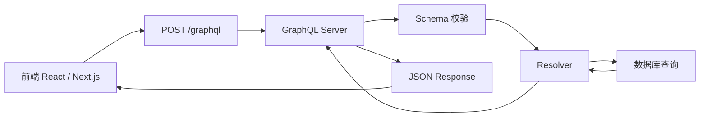
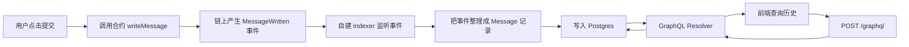

# 自建 GraphQL 服务需要哪些东西，以及整条链路是怎么跑起来的

这篇文档回答的是你刚才那个很自然的问题：

> 如果我不想依赖 The Graph，或者我就是想自己搭一个 GraphQL 服务，那我到底需要准备什么？整条链路是怎么工作的？

先直接给结论：

## 0. 先说答案

如果你要自建 GraphQL 服务，通常至少要有这几层：

1. `GraphQL 服务端`
   负责接收前端请求、解析 query、校验 schema、执行 resolver、返回 JSON。
2. `数据源`
   最常见是数据库，比如 Postgres / MySQL / MongoDB。
3. `把 GraphQL 和数据源连起来的代码`
   也就是 resolver。

如果你做的是普通 Web 应用，到这里通常就够了。

如果你做的是链上项目，还会多出一层：

4. `链上数据同步器 / indexer`
   负责监听合约事件，把链上原始数据整理后写入数据库。

所以可以把它记成两种形态：

### 普通 Web 项目

`前端 -> GraphQL 服务端 -> resolver -> 数据库`

### 链上项目

`前端 -> GraphQL 服务端 -> resolver -> 数据库 <- indexer <- 区块链事件`

---

## 1. 为什么 GraphQL 服务端不能单独存在

很多初学者会以为：

> 我装了 GraphQL，就等于我已经有了一个能查数据库的后端。

其实不是。

GraphQL 只负责：

- 定义“允许查什么”
- 接收查询请求
- 把结果按约定格式返回

但 GraphQL 本身并不知道：

- 你的数据库在哪里
- 表结构长什么样
- 应该怎么查
- 是否要先过滤、排序、分页

这些事情都要你自己通过 resolver 告诉它。

所以 GraphQL 更像是一个“API 协议层”，不是数据库驱动。

---

## 2. 你可以把自建 GraphQL 想成“餐厅点单系统”

这个类比很适合记忆。

- `GraphQL schema`
  像菜单，告诉你能点什么。
- `GraphQL query`
  像顾客下单，告诉服务员你这次具体要什么。
- `resolver`
  像后厨接单后真正做菜的人。
- `database`
  像厨房仓库，食材真正存放的地方。
- `GraphQL response`
  像最终端到你桌上的菜。

所以顾客并不是直接进仓库拿菜。

对应到程序里就是：

- 前端不会直接连数据库
- 前端只会请求 GraphQL 服务
- GraphQL 服务再调用 resolver 去查数据库

---

## 3. 一条最基础的自建 GraphQL 链路长什么样

先看最通用的版本。



逐步解释一下：

1. 前端发一个 HTTP 请求到 `/graphql`
2. GraphQL 服务端收到请求
3. 解析这次 query
4. 看 schema 里允不允许这么查
5. 找到对应 resolver
6. resolver 去数据库拿数据
7. GraphQL 服务端把数据包装成标准 JSON 返回

---

## 4. 这几层各自负责什么

### 4.1 GraphQL 服务端

它负责的是“入口”和“调度”。

常见库有：

- `Apollo Server`
- `GraphQL Yoga`
- `Mercurius`
- `Helix`

它们本质上都在做几件事：

- 提供 `/graphql` endpoint
- 接收 query / variables
- 解析 GraphQL 语法
- 根据 schema 校验字段
- 调用 resolver
- 返回 GraphQL 标准格式的响应

所以它更像框架，不是数据库层。

---

### 4.2 Schema

schema 是一份合同，定义“客户端能查什么”。

例如：

```graphql
type Message {
  id: ID!
  title: String!
  content: String!
}

type Query {
  messages: [Message!]!
}
```

它只是在说：

- 系统里有 `Message`
- 可以查询 `messages`
- `Message` 有哪些字段

它还没有真的去查数据库。

---

### 4.3 Resolver

resolver 才是实际执行查询的地方。

你可以把它理解成：

- GraphQL 世界的 controller
- 或者 service

比如：

```ts
const resolvers = {
  Query: {
    messages: async () => {
      return await db.select().from(messageTable);
    },
  },
};
```

这段才是真正把 GraphQL 和数据库绑起来的地方。

所以你刚才说的“是不是需要和数据库绑定”，答案是：

> 对，但不是 GraphQL 自动绑定，而是你在 resolver 里手动绑定。

---

### 4.4 Database

数据库才是真正存数据的地方。

例如：

- Postgres
- MySQL
- SQLite
- MongoDB

GraphQL 只是站在数据库前面的一层查询 API。

---

## 5. 用最小代码看懂“绑定数据库”到底是什么意思

下面是一段最小思维模型。

```ts
const typeDefs = `#graphql
  type Todo {
    id: ID!
    text: String!
    completed: Boolean!
  }

  type Query {
    todos: [Todo!]!
  }
`;

const resolvers = {
  Query: {
    todos: async () => {
      return await db.select().from(todoTable);
    },
  },
};
```

这一段要分开看：

### `typeDefs`

是在定义 API 合同：

- 有 `Todo`
- 可以查 `todos`

### `resolvers.Query.todos`

是在定义执行逻辑：

- 当有人查询 `todos`
- 就去数据库执行 `db.select().from(todoTable)`

所以“GraphQL 绑定数据库”的本质就是：

`某个 query 字段 -> 对应一个 resolver -> resolver 里调用数据库`

---

## 6. 如果放到你当前仓库来理解，会更容易

你这个仓库其实已经有“服务端 + 数据库访问层”的雏形了，只是现在用的是 `tRPC`，不是 GraphQL。

### 现有数据库入口

[packages/db/src/index.ts](/Volumes/HS-SSD-1TB/works/my-dapp-home-work-30/packages/db/src/index.ts)

```ts
export function createDb() {
  return drizzle(env.DATABASE_URL, { schema });
}

export const db = createDb();
```

这层的职责是：

- 连接数据库
- 暴露 `db`
- 让上层服务去查库

### 现有数据表定义

[packages/db/src/schema/todo.ts](/Volumes/HS-SSD-1TB/works/my-dapp-home-work-30/packages/db/src/schema/todo.ts)

```ts
export const todo = pgTable("todo", {
  id: serial("id").primaryKey(),
  text: text("text").notNull(),
  completed: boolean("completed").default(false).notNull(),
});
```

这层的职责是：

- 定义数据库表结构

### 现有 API 查询逻辑

[packages/api/src/routers/todo.ts](/Volumes/HS-SSD-1TB/works/my-dapp-home-work-30/packages/api/src/routers/todo.ts)

```ts
getAll: publicProcedure.query(async () => {
  return await db.select().from(todo);
}),
```

这段虽然不是 GraphQL resolver，但思维非常像。

你完全可以把它脑补成：

```ts
Query: {
  todos: async () => {
    return await db.select().from(todo);
  }
}
```

也就是说，你仓库里其实已经有这条链：

`API 层 -> db -> Postgres`

如果换成 GraphQL，只是 API 层的入口形式变了，数据库访问思路并不会变。

### 现有服务端入口

[apps/server/src/index.ts](/Volumes/HS-SSD-1TB/works/my-dapp-home-work-30/apps/server/src/index.ts)

现在它挂的是：

```ts
app.use("/trpc/*", trpcServer(...))
```

如果以后要加 GraphQL，思路一般是：

- 保留 `/trpc`
- 再新增一个 `/graphql`
- 或者直接让 `/graphql` 成为新的查询入口

---

## 7. 所以自建 GraphQL 服务，最常见的代码分层是什么

建议你把它想成下面这 4 层：

```text
1. schema 层
2. resolver 层
3. service / repository 层
4. database 层
```

举个简化例子：

```text
apps/server
  └── src/graphql
      ├── schema.ts
      ├── resolvers.ts
      └── context.ts

packages/db
  ├── src/index.ts
  └── src/schema/*
```

职责拆分：

- `schema.ts`
  定义客户端能查什么
- `resolvers.ts`
  把 query 映射到具体逻辑
- `service/repository`
  可选，把数据库读写进一步封装
- `packages/db`
  真正连接和查询数据库

---

## 8. 一个完整请求从头到尾到底怎么流动

我们用 “查询 todo 列表” 举例。

前端请求：

```graphql
query {
  todos {
    id
    text
    completed
  }
}
```

这条请求在系统里会经历：

### 第一步：前端发请求

前端通常会做这件事：

```ts
const response = await fetch("/graphql", {
  method: "POST",
  headers: { "content-type": "application/json" },
  body: JSON.stringify({
    query: `
      query {
        todos {
          id
          text
          completed
        }
      }
    `,
  }),
});
```

### 第二步：GraphQL 服务端解析 query

服务端会看到：

- 你在查 `todos`
- 你想要 `id` `text` `completed`

### 第三步：按 schema 校验

如果 schema 里没有 `todos`，或者 `Todo` 里没有 `completed`，这一步就会报错。

### 第四步：执行 resolver

服务端找到对应逻辑：

```ts
Query: {
  todos: async () => {
    return await db.select().from(todo);
  },
}
```

### 第五步：resolver 查数据库

这里才真正发生数据库查询。

比如底层等价于：

```sql
SELECT id, text, completed FROM todo;
```

### 第六步：返回 GraphQL 标准响应

最终前端拿到：

```json
{
  "data": {
    "todos": [
      { "id": "1", "text": "Learn GraphQL", "completed": false }
    ]
  }
}
```

你可以看到，GraphQL 本身没有直接碰数据库。

它只是：

- 收请求
- 找 resolver
- 让 resolver 去查
- 再把结果包装回来

---

## 9. 到这里为止，已经够支撑普通 Web 应用了

如果你只是做一个普通网站，比如：

- 用户系统
- Todo 列表
- 商品列表
- 评论系统

那么这套就够了：

`前端 -> GraphQL -> resolver -> 数据库`

这类系统里，数据通常是后端自己写入数据库的，所以不需要额外 indexer。

---

## 10. 但链上项目为什么又复杂一层

你这个项目是 DApp，所以数据源不止一个。

消息最初不是直接进数据库，而是先上链：

```text
用户调用合约 -> 合约 emit 事件 -> 链上产生日志
```

这时候如果你要自建 GraphQL，而不是用 The Graph，那么你就得自己补上“中间同步层”。

也就是：

```text
区块链日志 -> 你的 indexer -> 数据库 -> GraphQL 服务
```

这一步是很多初学者容易漏掉的。

因为 GraphQL 服务端并不会自动帮你扫链。

---

## 11. DApp 自建 GraphQL 的完整链路

这一条才是最贴近你现在项目的版本。



这里要拆成两条不同方向的链路看。

### 写入链路

`钱包提交交易 -> 合约 emit 事件 -> indexer 抓事件 -> 写数据库`

### 读取链路

`前端发 GraphQL query -> resolver 查数据库 -> 返回列表`

这两条链路会在数据库会合。

---

## 12. 为什么 The Graph 会让事情简单很多

因为 The Graph 已经帮你做掉了这几件事：

- 监听链上事件
- 处理区块同步
- 做事件解析
- 建立索引存储
- 暴露 GraphQL API

所以你现在的 The Graph 模式可以理解成：

`链上事件 -> The Graph 内部 indexer + store + GraphQL -> 前端`

如果你选择自建，就等于你要自己实现其中的一部分。

最常见就是自己补这三块：

1. `indexer`
2. `database`
3. `GraphQL server`

---

## 13. 自建链上 GraphQL 时，数据库里到底存什么

最常见做法是：不要把区块链当成“查询数据库”，而是把链上事件同步成业务表。

比如你现在的事件是：

[MessageBoard.sol](/Volumes/HS-SSD-1TB/works/my-dapp-home-work-30/packages/contracts/contracts/MessageBoard.sol)

```solidity
event MessageWritten(
    address indexed author,
    string title,
    string content,
    uint256 createdAt
);
```

那么你自建数据库里可能有一张 `messages` 表：

```ts
id
author
title
content
createdAt
blockNumber
transactionHash
logIndex
```

这张表本质上就是你自己维护版的 “subgraph entity store”。

也就是说：

- The Graph 的 `Message @entity`
  是由 The Graph 帮你维护
- 自建数据库里的 `messages`
  是由你自己的 indexer 帮你维护

---

## 14. 一个非常实用的心智模型

如果你有点晕，可以直接这么记：

### The Graph 方案

`event -> The Graph mapping -> entity store -> GraphQL`

### 自建方案

`event -> 你自己的 indexer -> Postgres -> GraphQL`

两者本质上在做同一件事：

- 都是在把链上原始事件
- 转成适合前端查询的结构化数据

区别只在于：

- The Graph 帮你托管了中间层
- 自建服务需要你自己写和自己维护

---

## 15. 如果你真的要落地自建，最常见的技术组合是什么

有很多种搭法，但对你这个仓库来说，最顺的一种通常是：

### 普通查询层

- `GraphQL Yoga` 或 `Apollo Server`
- 挂在 `apps/server`

### 数据库层

- `Postgres`
- 继续复用你已有的 `Drizzle`

### 链上同步层

- 一个独立 worker / cron / 常驻进程
- 用 `viem` 或 `ethers` 监听 `MessageWritten`
- 把解析后的数据写入 `packages/db`

所以你仓库里的复用关系大概会是：

```text
apps/server           -> 新增 /graphql 入口
packages/db           -> 继续负责数据库连接和 schema
packages/contracts    -> 提供 ABI / 合约地址 / 事件定义
apps/web              -> 改成请求你自建的 /graphql
```

---

## 16. 你不用一上来就把全部东西都做出来

如果以后你真的要练手自建，我建议按这个顺序来。

### 第一步：先只做“普通 GraphQL + 数据库”

先不碰链上监听。

先把一张普通 `messages` 或 `todo` 表跑通：

- schema
- resolver
- 查询接口

目标只是先理解：

`GraphQL query -> resolver -> db.select()`

### 第二步：再写“把链上事件同步到数据库”的脚本

也就是 indexer。

目标是先理解：

`event -> insert into messages`

### 第三步：最后让 GraphQL 查这张同步后的表

这时候你脑子里会特别清楚：

- GraphQL 不负责扫链
- indexer 不负责给前端提供查询协议
- 数据库负责作为两条链路的汇合点

---

## 17. 什么时候适合用 The Graph，什么时候适合自建

这不是非黑即白，主要看你的需求。

### 更适合 The Graph 的情况

- 主要数据来自链上事件
- 查询模型比较标准
- 你不想自己维护 indexer
- 想尽快把“链上数据可查询”这件事跑通

### 更适合自建的情况

- 你要接很多链下业务数据
- 你要做复杂权限控制
- 你要把链上和链下数据 join 在一起
- 你要完全掌控数据库结构和服务端逻辑
- 你不想依赖第三方托管索引服务

---

## 18. 最后把整件事压缩成一句最重要的话

如果你要自建 GraphQL，真正要搭的是：

`GraphQL 服务端 + resolver + 数据库`

如果你做的是 DApp，自建时通常还要再加：

`indexer`

所以完整心智模型就是：

`前端 -> GraphQL -> resolver -> 数据库 <- indexer <- 区块链事件`

---

## 19. 对你当前项目最贴切的翻译版

把你这个仓库里的概念翻译一下：

- `packages/db`
  就是数据库层
- `packages/api`
  已经很接近 resolver / service 层了，只是现在不是 GraphQL 协议
- `apps/server`
  是 HTTP 服务入口
- `packages/subgraph`
  是当前采用的托管索引方案

所以如果以后你想从 The Graph 切到自建，不是“推倒重来”，而更像是：

1. 保留 `contracts`
2. 自己补一个 indexer
3. 自己补一个 GraphQL endpoint
4. 让 endpoint 查你自己的数据库

---

## 20. 建议你接下来怎么学

如果你现在的目标是“真正学会这条链路”，最推荐的顺序是：

1. 先把这篇文档读顺
2. 再对照你仓库里的 [packages/db/src/index.ts](/Volumes/HS-SSD-1TB/works/my-dapp-home-work-30/packages/db/src/index.ts) 和 [packages/api/src/routers/todo.ts](/Volumes/HS-SSD-1TB/works/my-dapp-home-work-30/packages/api/src/routers/todo.ts)
3. 脑补一下如果把 `todoRouter.getAll` 换成 GraphQL resolver 会长什么样
4. 最后再去看你现在的 The Graph 文档，理解“它其实是在替你做 indexer + store + GraphQL”

如果你愿意，我下一步可以继续帮你补第三篇文档，直接画成“对比图”：

- `The Graph 方案`
- `自建 GraphQL 方案`
- `tRPC 方案`

把这三种在你仓库里的位置一次讲透。
