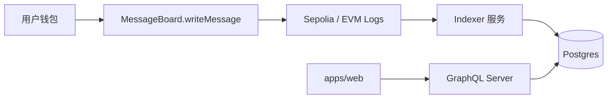
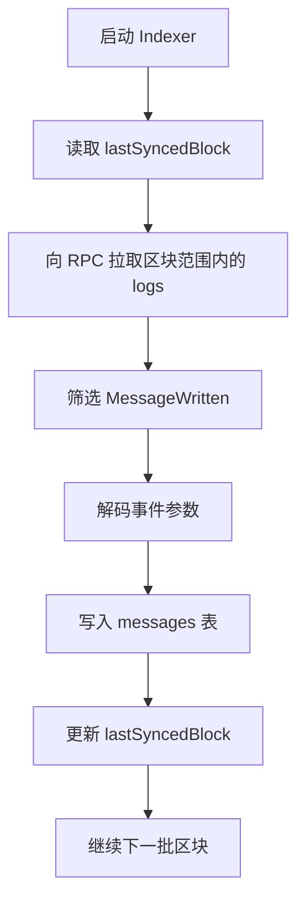

# 自建 GraphQL 方案说明书

这篇文档不是单纯讲 GraphQL 概念，而是专门回答：

> 如果要在你这个仓库里自己搭一套 GraphQL 服务，不依赖 The Graph，应该怎么设计？

它会尽量用你仓库里已经有的东西来讲：

- `apps/server`
- `packages/api`
- `packages/db`
- `packages/contracts`
- `apps/web`

这样你读完不是只知道“原理”，而是能知道“该放到哪里”。

---

## 1. 方案目标

我们想实现的是下面这件事：

1. 用户调用链上合约 `writeMessage`
2. 合约发出 `MessageWritten` 事件
3. 我们自己的后台服务监听这个事件
4. 后台把事件整理后写入数据库
5. 前端通过自建 GraphQL endpoint 查询消息历史

也就是：

`合约事件 -> 自建索引器 -> 数据库 -> 自建 GraphQL -> 前端`

---

## 2. 先给出最终架构图



这张图里有 3 条关键线：

- 写入线：`钱包 -> 合约 -> 链上事件`
- 同步线：`链上事件 -> indexer -> 数据库`
- 查询线：`前端 -> GraphQL -> 数据库`

注意，GraphQL 只在“查询线”上，不在“同步线”上。

---

## 3. 为什么这套方案比 The Graph 多几层

你现在用 The Graph 的时候，很多事情是它替你做了：

- 监听事件
- 区块追踪
- 数据索引
- 存储实体
- 暴露 GraphQL API

如果改成自建，你需要自己补这 3 个角色：

1. `Indexer`
   负责扫链和解析事件
2. `Database`
   负责保存整理后的结构化记录
3. `GraphQL Server`
   负责提供前端可查询的 API

所以真正的变化不是“把 endpoint 换一下”，而是把 The Graph 中间那层换成你自己的服务。

---

## 4. 在你这个仓库里，最推荐的职责划分

结合现在的目录，最顺手的一种划分是：

```text
apps/
  web/           前端页面，发 GraphQL 请求
  server/        HTTP 服务入口，挂 /graphql

packages/
  contracts/     合约、ABI、地址、事件定义
  db/            Postgres + Drizzle schema
  api/           可复用的数据访问逻辑 / service 层
  subgraph/      当前 The Graph 方案文档，可作为对照

workers/
  indexer/       自建链上监听器（建议新建）
```

如果你不想新建 `workers/indexer`，也可以先放到：

```text
apps/server/src/indexer
```

但从长期维护来说，我更推荐把它做成独立进程，因为：

- 它和 HTTP 服务不是同一种运行模式
- 它通常需要常驻或定时跑
- 它的失败重试逻辑、区块进度管理会和 API 服务不太一样

---

## 5. 每一层分别做什么

### 5.1 合约层

你现在已经有了：

[MessageBoard.sol](/Volumes/HS-SSD-1TB/works/my-dapp-home-work-30/packages/contracts/contracts/MessageBoard.sol)

关键事件：

```solidity
event MessageWritten(
    address indexed author,
    string title,
    string content,
    uint256 createdAt
);
```

这层负责：

- 定义链上事实来源
- 产生标准化事件日志

你可以把它理解成：

“原始数据生产者”

---

### 5.2 Indexer 层

这是自建方案里最关键、也是最容易被忽略的一层。

它负责：

- 连接 RPC 节点
- 从指定起始区块开始扫描 `MessageWritten`
- 把日志解码成结构化数据
- 去重
- 写入数据库
- 记录同步进度

它做的事情，本质上非常像 The Graph 的 mapping + indexing。

只不过现在不再是：

```text
event -> subgraph mapping -> entity.save()
```

而是：

```text
event -> viem decodeEventLog -> db.insert(messages)
```

---

### 5.3 Database 层

你现在已经有：

[packages/db/src/index.ts](/Volumes/HS-SSD-1TB/works/my-dapp-home-work-30/packages/db/src/index.ts)

```ts
export function createDb() {
  return drizzle(env.DATABASE_URL, { schema });
}
```

这一层负责：

- 提供数据库连接
- 提供表 schema
- 给 indexer 和 GraphQL resolver 共用

在自建 GraphQL 方案里，数据库是整个系统的“汇合点”：

- 上游：indexer 写入数据
- 下游：GraphQL 读取数据

---

### 5.4 GraphQL Server 层

这一层负责：

- 暴露 `/graphql`
- 校验 query
- 调用 resolver
- 返回 JSON

推荐挂在：

[apps/server/src/index.ts](/Volumes/HS-SSD-1TB/works/my-dapp-home-work-30/apps/server/src/index.ts)

你现在已经有 Hono 服务器和 `/trpc/*`：

```ts
app.use("/trpc/*", trpcServer(...))
```

自建 GraphQL 时最自然的做法就是并排再挂一个：

```text
/graphql
```

也就是：

- 保留 tRPC
- 新增 GraphQL
- 两套都走同一个 Node/Hono 服务

---

### 5.5 前端层

前端还是做一件熟悉的事：

- 用 `fetch` 发送 HTTP 请求

只不过从：

```text
请求 The Graph endpoint
```

改成：

```text
请求你自己的 /graphql
```

你现在的：

[constant.ts](/Volumes/HS-SSD-1TB/works/my-dapp-home-work-30/apps/web/src/app/eth-event-logs/constant.ts)

和：

[useMessageHistory.ts](/Volumes/HS-SSD-1TB/works/my-dapp-home-work-30/apps/web/src/app/eth-event-logs/useMessageHistory.ts)

都可以继续复用思路，只是 endpoint 不同。

---

## 6. 建议新增的数据表

如果要自建，最少建议补两张表。

### 6.1 `messages`

存业务记录。

建议字段：

```ts
id
author
title
content
createdAt
blockNumber
blockTimestamp
transactionHash
logIndex
chainId
```

作用：

- 给前端做历史列表
- 支持按时间倒序
- 支持按作者过滤
- 支持按交易哈希定位

这里的 `id` 最自然的做法一般是：

```text
transactionHash + "-" + logIndex
```

因为一笔交易里可能有多个同类事件。

### 6.2 `indexer_state`

存同步进度。

建议字段：

```ts
name
lastSyncedBlock
updatedAt
```

作用：

- 记录 indexer 已经处理到哪个区块
- 避免每次启动都从创世区块重扫
- 支持断点续跑

这一张表在真实项目里非常重要。

没有它，你的 indexer 很容易：

- 重复插入
- 启动太慢
- 重扫太多区块

---

## 7. 建议的代码目录

下面是一套比较清楚的目录方案。

```text
apps/server/src/
  index.ts
  graphql/
    schema.ts
    resolvers.ts
    context.ts
    server.ts

packages/db/src/schema/
  todo.ts
  message.ts
  indexerState.ts

workers/indexer/src/
  index.ts
  messageBoardIndexer.ts
  checkpoint.ts
  decode.ts
```

你可以把它理解成：

- `graphql/schema.ts`
  定义客户端能查什么
- `graphql/resolvers.ts`
  定义怎么查数据库
- `workers/indexer`
  定义怎么扫链并入库

---

## 8. GraphQL schema 应该长什么样

最小可用版大概是：

```graphql
type Message {
  id: ID!
  author: String!
  title: String!
  content: String!
  createdAt: String!
  blockNumber: String!
  blockTimestamp: String!
  transactionHash: String!
}

type Query {
  messages(first: Int = 20): [Message!]!
  message(id: ID!): Message
}
```

这里要注意两点：

### 为什么很多链上数字会先用 `String`

因为：

- `BigInt` 在数据库、GraphQL、JSON、前端之间传递时容易有类型边界问题
- 先统一返回字符串，前端需要的时候再转，是更稳的做法

### 为什么先只做 Query，不着急做 Mutation

因为你的写入不是走 GraphQL mutation，而是走钱包签名 + 合约调用。

也就是说：

- “写链上数据” 走 `wagmi + writeContract`
- “读历史数据” 走 GraphQL query

这和普通 Web 项目不太一样。

---

## 9. Resolver 应该长什么样

最简单的 resolver 心智模型：

```ts
const resolvers = {
  Query: {
    messages: async (_parent, args, ctx) => {
      return await ctx.db.query.message.findMany({
        orderBy: (message, { desc }) => [desc(message.blockTimestamp)],
        limit: args.first ?? 20,
      });
    },

    message: async (_parent, args, ctx) => {
      return await ctx.db.query.message.findFirst({
        where: (message, { eq }) => eq(message.id, args.id),
      });
    },
  },
};
```

这里要抓住一个核心点：

- GraphQL 只是入口
- 真正查库的是 resolver

所以 resolver 和你现在的：

[packages/api/src/routers/todo.ts](/Volumes/HS-SSD-1TB/works/my-dapp-home-work-30/packages/api/src/routers/todo.ts)

思维几乎一致。

你甚至可以理解为：

- `tRPC procedure`
- `GraphQL resolver`

在“查库”这件事上，本质很像，只是协议格式不同。

---

## 10. Indexer 应该怎么工作

这是整个方案里最值得你认真理解的一层。

建议它按下面流程工作：



它的核心职责不是“提供 API”，而是“把链上原始日志变成数据库记录”。

你可以把它想成一个 ETL 管道：

- Extract：从链上取日志
- Transform：转成结构化消息
- Load：写入数据库

---

## 11. 一条消息从提交到展示，完整链路是什么

我们用你现在的 `MessageBoard` 场景走一遍。

### 第一步：用户发交易

前端通过：

[useMessageBoardWrite.ts](/Volumes/HS-SSD-1TB/works/my-dapp-home-work-30/apps/web/src/app/eth-event-logs/useMessageBoardWrite.ts)

调用：

```text
writeMessage(title, content)
```

### 第二步：合约发事件

链上产生：

```text
MessageWritten(author, title, content, createdAt)
```

### 第三步：indexer 扫到这个事件

它会拿到：

- author
- title
- content
- createdAt
- blockNumber
- transactionHash
- logIndex

### 第四步：indexer 写数据库

例如写成：

```text
messages:
  id = txHash-logIndex
  author = 0x...
  title = ...
  content = ...
```

### 第五步：前端请求 `/graphql`

```graphql
query Messages($first: Int!) {
  messages(first: $first) {
    id
    author
    title
    content
    transactionHash
  }
}
```

### 第六步：resolver 查数据库并返回

前端最终渲染历史列表。

把这条线压缩成一行，就是：

`钱包写链 -> 链上事件 -> indexer 入库 -> GraphQL 查库 -> 页面展示`

---

## 12. 这套方案和当前 The Graph 方案怎么对应

这是最关键的对照关系。

### 当前 The Graph 方案

`MessageWritten -> subgraph.yaml -> message-board.ts -> entity.save() -> GraphQL endpoint`

### 自建 GraphQL 方案

`MessageWritten -> indexer.ts -> db.insert(messages) -> /graphql -> resolver`

你会发现两者本质上在做同一件事：

- 都有事件来源
- 都有中间转换层
- 都有可查询存储
- 都有 GraphQL 查询出口

只是：

- The Graph 把中间层托管了
- 自建方案把中间层放回你自己的系统里

---

## 13. 最推荐的落地顺序

如果以后你真的要做，我建议按这个顺序来，不要一口气全上。

### 第一步：先建数据库表

先把 `messages` 和 `indexer_state` 定义好。

目标：

- 明确你最终要查的数据模型

### 第二步：先跑通一个普通 GraphQL 查询

哪怕先手动插入几条测试数据也行。

目标：

- 先验证 `/graphql -> resolver -> db` 这条线

### 第三步：再写 indexer

让数据库不再依赖手工插入，而是依赖链上事件同步。

目标：

- 跑通 `event -> db`

### 第四步：最后切前端 endpoint

让：

[useMessageHistory.ts](/Volumes/HS-SSD-1TB/works/my-dapp-home-work-30/apps/web/src/app/eth-event-logs/useMessageHistory.ts)

从请求 The Graph 改成请求你自己的服务。

目标：

- 前端无感切换数据源

---

## 14. 这套方案最大的优点

### 完全可控

你可以决定：

- 表结构
- 索引方式
- 查询方式
- 鉴权
- 缓存
- 多数据源 join

### 方便接链下业务

比如你以后想给消息加：

- 用户昵称
- 头像
- 审核状态
- 点赞数

这些通常不是纯链上事件能优雅表达的。

自建数据库更容易把链上和链下数据放到一起查询。

### 可以保留现有服务风格

你现在已经有：

- Hono
- tRPC
- Drizzle

所以并不是从零开始。

---

## 15. 这套方案最大的代价

### 运维成本更高

你要自己处理：

- RPC 稳定性
- 区块回滚
- 重复事件
- 断点续跑
- 数据库迁移
- 服务部署

### 心智负担更重

因为系统从：

```text
前端 + 合约 + The Graph
```

变成：

```text
前端 + 合约 + indexer + 数据库 + GraphQL 服务
```

所以这套方案更灵活，但也更重。

---

## 16. 什么时候值得上自建方案

更适合自建的情况通常是：

- 你要把链上和链下数据统一查询
- 你要复杂筛选、排序、聚合
- 你要权限控制
- 你要完全掌控存储和接口
- 你不想依赖第三方托管服务

如果你的场景只是：

- 简单事件索引
- 简单列表查询
- 快速上线

那 The Graph 往往还是更省事。

---

## 17. 对你这个仓库的一个最简落地版本

如果我按“尽量少改动现有结构”的原则给你一个版本，我会建议：

### 服务端

- 在 `apps/server` 新增 `/graphql`

### 数据库

- 在 `packages/db/src/schema` 新增 `message.ts`
- 在 `packages/db/src/schema` 新增 `indexerState.ts`

### 同步器

- 新建 `workers/indexer`
- 用 `viem` 扫 `MessageWritten`

### 前端

- 保留 `useMessageBoardWrite.ts`
- 只替换 `useMessageHistory.ts` 的数据来源

这样变化最小，因为：

- 写链逻辑完全不动
- 页面 UI 几乎不动
- 只是把“历史消息的来源”从 The Graph 改成你的数据库

---

## 18. 一句话收尾

自建 GraphQL 方案的本质不是“装一个 GraphQL 包”，而是自己补齐这条链：

`链上事件 -> indexer -> 数据库 -> resolver -> GraphQL endpoint -> 前端`

如果你把这条线想清楚了，后面不管是 The Graph、tRPC 还是自建 GraphQL，你都会很容易分清每层到底在做什么。

如果你愿意，我下一步可以继续直接帮你补一份“实施版文档”，把它写成开发任务清单：

- 第一步改哪个文件
- 第二步加哪张表
- 第三步 `/graphql` 最小代码怎么写
- 第四步 indexer 最小脚手架怎么写
